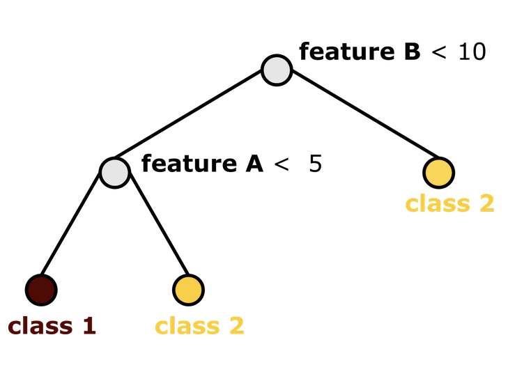
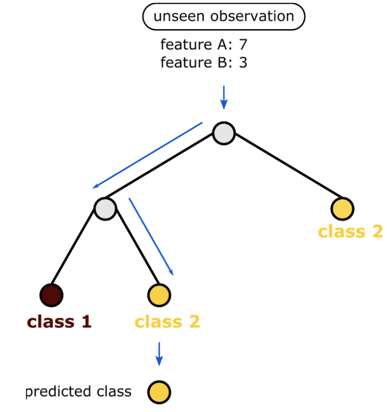
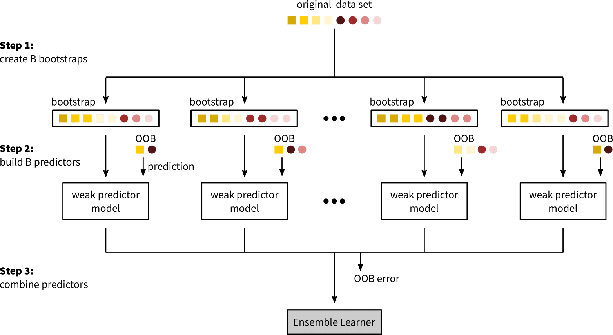
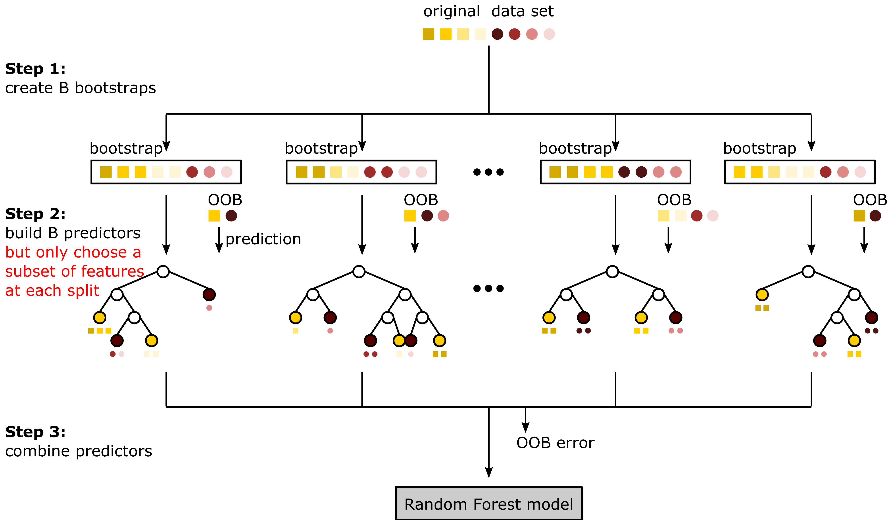

Introduction to Random Forest Models
=====================================

Decision Trees
---------------

Decision Trees are a non-parametric supervised learning method used for classification and regression (here, we focus on classification tress). 
The goal is to create a model that predicts the value of a target variable by learning simple decision rules inferred from the data features. 
A decision tree can be represented by a tree graph with one root node that contains the whole input data set, many internal nodes that represent 
the splitting points on the predictor variables X and terminal nodes that are not further split and contain a subgroups of Y belonging to a certain class as shown in the figure below.

    **Example of a classification tree:** Classification of a response variable into two classes (red and yellow) in the two-dimensional input feature space with a classification tree. 
    The classification tree makes two splits on feature A and feature B and has three terminal nodes, representing the subgroups of the response variable. 

The first step in constructing a decision tree is to split the root node based on the predictor variable X into two daughter nodes to improve the homogeneity of the response variable Y 
in each daughter node compared to the root node. Maximizing the homogeneity of the response variable Y is equivalent to minimizing the node impurity in both daughter nodes. 
The node impurity for a classification problem with K classes can be measured by different impurity indices. The most popular impurity index is the **gini index** with values between 0 and 1. 
Small Gini index values indicate a more pure node than higher gini index values. This splitting step is repeated with the two daughter nodes, which now become internal nodes, 
to successively improve the homogeneity of the response variable in each daughter node until we reach a predefined stopping criterion. 
A natural stopping criterion is the node purity, where the tree is grown until the terminal nodes are homogeneous, hence all members in a terminal node belong to the same class. 
This however, often leads to model overfitting, because the model starts being too complex and tends to learn the noise in the data as well. 
An appropriate stopping criterion serves the purpose of finding a balance between too complex models, which overfits the data, and too simple models, 
which underfits the data, both leading to a high generalization error. 

The constructed decision tree can then be used to predict the class of a new unseen observation: start at the root node, drop the new observation down the left or right daughter node, 
depending on its value of the predictor variable that was used at that split, repeat until a terminal node is reached. 
For each new observation that falls into a certain terminal node we will make the same prediction, which is the majority class of the response values y in that terminal node.

Decision trees are very sensitive to changes in the input data and are prone to overfitting when constructing trees that are too complex. 
To avoid such problems one can build a model based on an ensemble of decision trees, trained on bootstrapped input data.

Ensemble Learning
------------------

The predictive performance of weak ML models like decision trees can be improved by a technique called ensemble learning, which combines a group of weak predictor models, 
to form a strong ensemble learner. The idea behind ensemble learning is to improve the predictive performance by reducing the variance of the predictor. 
Common methods for ensemble learning are Bagging (Bootstrap Aggregation), Boosting or Randomization. Here, the focus is on Bagging, a method introduced in 1996 by Breiman et al. (Breiman, 1996) 
that can be used to aggregate multiple decision trees to form a strong ensemble and is used in the machine learning algorithm Random Forest. 

In Bagging, trees are fully grown, hence have a low bias, but predictions are averaged over multiple trees which reduces variance. 
To build a bagged model, B bootstrap samples are drawn from the training set and on each bootstrap sample a decision tree is trained. 
To obtain the predicted class for a new observation, the majority class across all trained decision trees in the bagged model is calculated. 
The validation error of the bagged model can be calculated during the training phase through the Out of Bag (OOB) error. 
The OOB error is an unbiased estimate of the validation error because it is calculated on the OOB data, which is the data that was not used to train the bagged model. 
To calculate the OOB error, the majority vote of the predictions for a training observation over all decision trees, in which observation was part of the OOB data, is calculated. 
The fraction of OOB observations that were classified incorrectly is then the OOB error. It was shown that OOB error estimates are nearly identical to k-fold cross-validation estimates.

The benefits of Bagging, i.e. variance reduction, are limited by the amount of correlation between predictor models. 
If decision trees are build on the same set of feature it is common that their structure highly correlates. 
To decrease the overall amount of correlation in the ensemble, the predictor models have to be decorrelated. 
The solution to this problem is implemented in an algorithm called Random Forest. 

Random Forest Algorithm
----------------------------

The Random Forest (RF) algorithm was introduced in 2001 by Breiman et al. (Breiman, 2001) and extends the Bagging algorithm by building an ensemble of decorrelated decision trees. 
Decision trees become correlated if only few features are strong predictors of the response variable, leading to the majority of decision trees having a 
similar structure (the strong predictor is used as first split in many trees) and therefore highly correlated predictions. 
To reduce the correlation between decision trees, RF performs random feature selection at each node prior to the selection of the optimal split. 
Hence, the reduction in node impurity is only computed on a random subset of predictor variables, which reduces the chance that strong predictors are always used as first splits.

In short, RF creates an ensemble of decision trees by fitting each decision trees to a different bootstrap sample, while selecting at each split a random subset of input features 
as candidates for splitting. The class of a new unseen observation x is then predicted asthe majority class across predictions for x made with all trees in the ensemble. 
By averaging the predictions over a large ensemble of high variance but low correlation and low bias decision trees, RF is able to improve the variance reduction of Bagging 
and efficiently reduce both components - bias and variance - of the generalization error. 

A RF model has several hyperparameters that have to be tuned during the training process. 
Two of them can have a major influence on the performance of the RF model: the number of decision trees in the model and the number of predictor variables that get randomly chosen at each split. 
As mentioned before, the generalization error of a RF model converges to an upper bound if the number of trees in the forest is large enough. 
Hence, the number of decision trees should be chosen as large as possible, limited by the available compute time, to improve the predictive power and avoid overfitting of the model. 
The number of randomly chosen predictor variables controls the amount of correlation between decision trees in the RF model. 
If we choose a value equal to the number of input features, the RF model reduces to Bagging on unpruned decision trees. 
As mentioned above, the generalization error of a RF model depends on the strength of each individual decision tree (bias) and the correlation between those decision trees (variance). 
By reducing the number of randomly selected features, we reduce the variance of the model but at the same time we increase the bias of each individual tree 
because we might not find the optimal predictor variable for each split. Hence, the number of randomly selected features is a tradeoff between bias and variance in the model 
and we can use the OOB error to find the best tradeoff for our model.