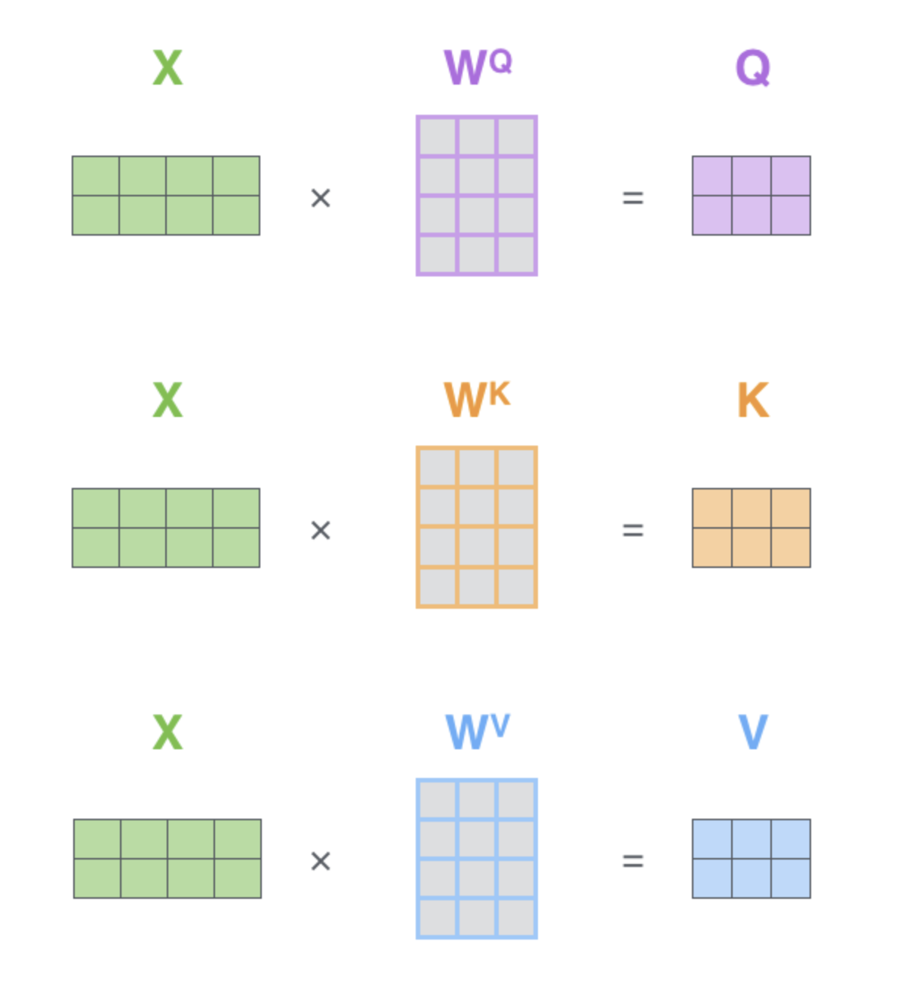
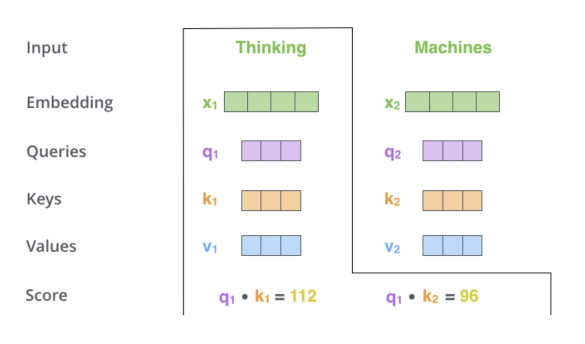
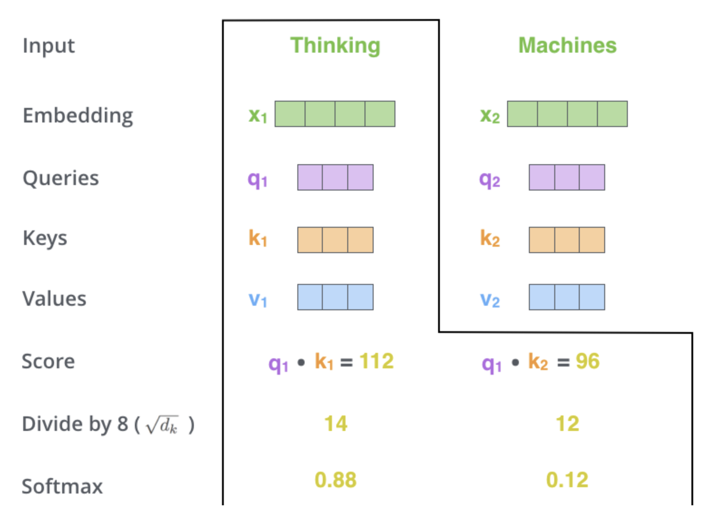
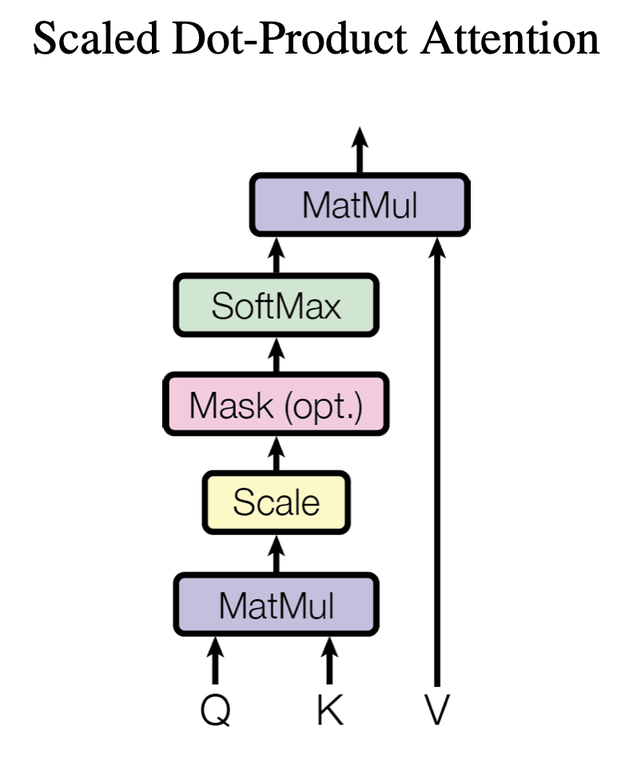
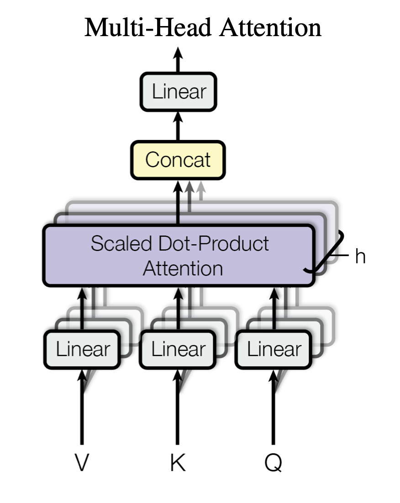
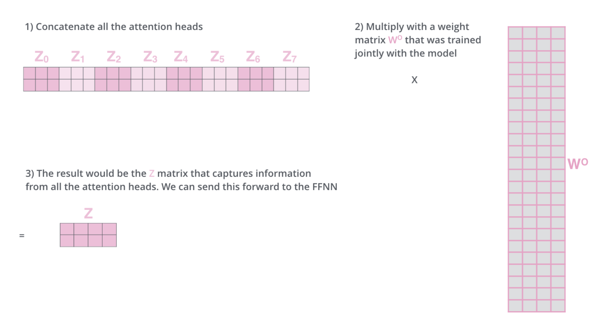

Introduction to Transformers
=========================================
...

For a short introduction to Transformers and their Self-Attention machanism, click below:

.. vimeo:: 940749237?h=4f7120ca0a"

    Short video lecture on the principles of Transfomers and Self-Attention.

Encoder-Decoder Structure
---------------------------

Transformers are a type of neural network architecture that has become a cornerstone in Natural Language Processing (NLP) and beyond. They were introduced in the 2017 paper "Attention is All You Need" by Vaswani et al. Transformers are a milestone because of the **Attention Mechanism**, especially self-attention. 

The Transformer architecture is divided into two main parts:

1. **Encoder:**
The encoder processes the input data (like a sentence in a translation task) and encodes it into a context-rich representation. It consists of a stack of layers, each containing a self-attention mechanism and a feed-forward neural network.

2. **Decoder:**
The decoder takes the encoded input and generates the output sequence (like a translated sentence). It also consists of a stack of layers, each with two attention mechanisms (one that attends to the output of the encoder and one that is a masked self-attention mechanism to prevent the decoder from seeing future tokens in the output sequence) and a feed-forward neural network.

.. figure:: ../_figures/transformers.png

The Self-Attention Mechanism
------------------------------

Before digging into the encoder and decoder architecture, let's talk about THE most important concept of transformers: the self-attention mechanism.

The goal of self-attention is to generate a representation of each element in a sequence by considering the entire sequence. For example, in a sentence, the representation of a word is computed by attending to all words in the sentence, including the word itself. Here, the word "attending" refers to the process where the model determines how much focus or importance to assign to each element in the input sequence when computing a representation for a specific element. 

**Components**

The main components are the tree vectors **Queries** (Q), **Keys** (K), and **Values** (V), which are computed for each element in the input sequence. These are typically created by multiplying the input embeddings with three different weight matrices.

Q represents the current element in the sequence, used to compute attention scores against all keys. K Represents all elements in the sequence. The attention scores are calculated by the dot product of the query with each key, determining the level of attention each element receives. V is the actual representation of the sequence elements. The attention mechanism uses the computed scores to create a weighted sum of these values, forming the output for each element.

**Attention Scores**

The model calculates the attention score for each pair of elements in the sequence. This is typically done by taking the dot product of the query vector of one element with the key vector of another, which indicates how much focus to put on other parts of the input sequence when encoding a particular element.

**Scaling and Normalization**

The dot product scores are scaled down (usually by the square root of the dimension of the key vectors), and a softmax function is applied to obtain the final attention weights. This normalization ensures that the weights across the sequence sum up to 1.

**Weighted Sum**

The output for each element is then a weighted sum of the value vectors, where the weights are the attention scores. This results in a new representation for each element incorporating information from the entire sequence.

.. figure:: ../_figures/qkv3.png

The overall mechanism, i.e. the sacled dot-product attention, can be summarized in the figure below.

The Mechanism of Multi-Head Attention
--------------------------------------

In multi-head attention, the attention mechanism is run in parallel multiple times. Each parallel run is known as a "head."
Each head learns to pay attention to different parts of the input, allowing the model to capture various aspects of the information (like different types of syntactic or semantic relationships).

The outputs of all attention heads are concatenated and then linearly transformed into the final output. This combination allows the model to pay attention to information from different representation subspaces at different positions.

References
------------
Vaswani. `Attention is all you need. <https://doi.org/10.48550/arXiv.1706.03762>`_ Advances in neural information processing systems. 2017.
