Introduction to Transformers
=========================================

The Transformer architecture was introduced in the 2017 paper *Attention Is All You Need* by Vaswani et al. It was originally developed for natural language processing tasks, especially machine translation, although the architecture itself is generic and is now widely used in applications such as chatbots and vision systems. 

The example used in this tutorial is German to English translation, e.g., “Ich habe Hunger” to “I am hungry”.

For a short introduction to Transformers, click below:

**Transformer Basic – Introduction to Transformers**

.. youtube:: aqIZG521uwE

**Background (before transformers)**:

- Sequence models such as RNNs, LSTMs, and GRUs process data sequentially.
- This sequential processing makes training slow since it cannot be parallelized.

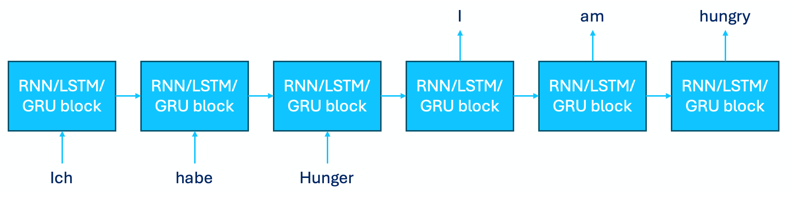

- These models struggle with long range dependencies, where information from earlier tokens may be lost over time (especially when the input is long).

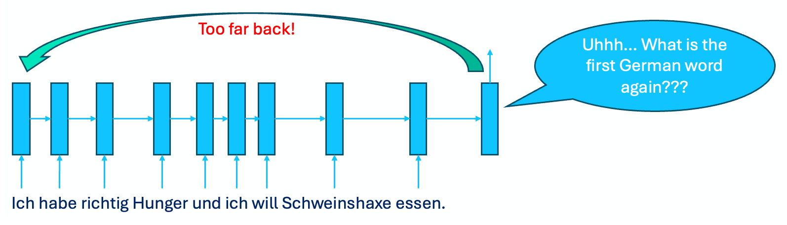

**Key ideas:**

- Uses attention to model relationships between all tokens in the sequence.
- Includes self attention to relate tokens within the same sequence.
- Uses cross attention to connect input and output sequences.
- Applies masked self attention in the decoder to ensure predictions depend only on past tokens during training.

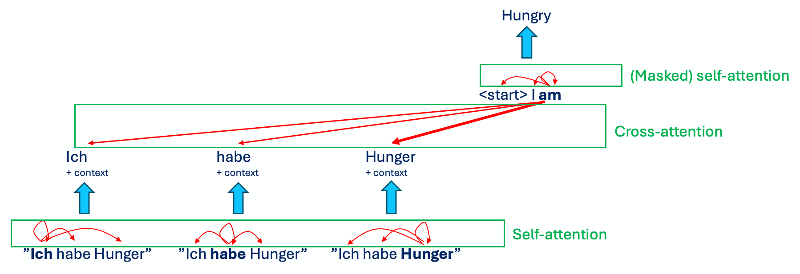

- Enables parallel computation, making training faster and more scalable.

**Architecture overview:**

- **Word embedding:** Converts tokens into vector representations, applied to both encoder and decoder inputs.
- **Positional encoding:** Adds word position information to embeddings, used in both encoder and decoder.
- **Encoder:** Processes the input into a context rich representation using stacked blocks with multi head self attention and feed forward layers.
- **Decoder:** Generates the output sequence using masked self attention and cross attention with the encoder output, based on the current and previously generated tokens.

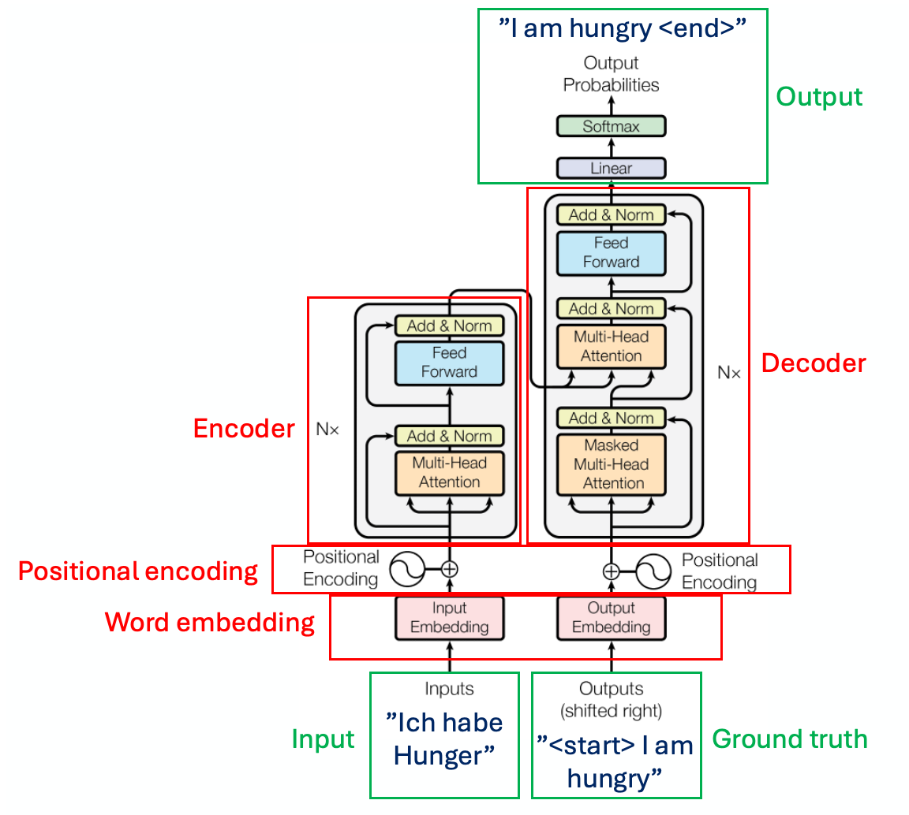

- **Training vs testing:**
    - During training, the decoder uses the ground truth shifted to the right (therefore, starting with <start> token) and uses masked self-attention trick so that the self-attention only attends the current and previous tokens. This trick makes the training parallelizable utilizing the available ground truth.
    - During testing it generates output tokens step by step.
- **Number of blocks N:** The number of encoder and decoder blocks can be adjusted to make the model shallower or deeper. By default, N = 6.

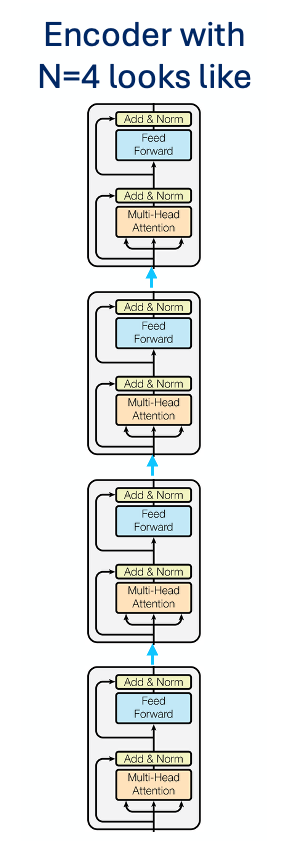

**Variants of transformers:**

- **Modality-wise:**
    - Words (natural language processing tasks)
    - Images (using image patches, e.g. Vision Transformer)
    - Audio (using chunks of sound)
    - Biological sequences (e.g. DNA or protein sequences)

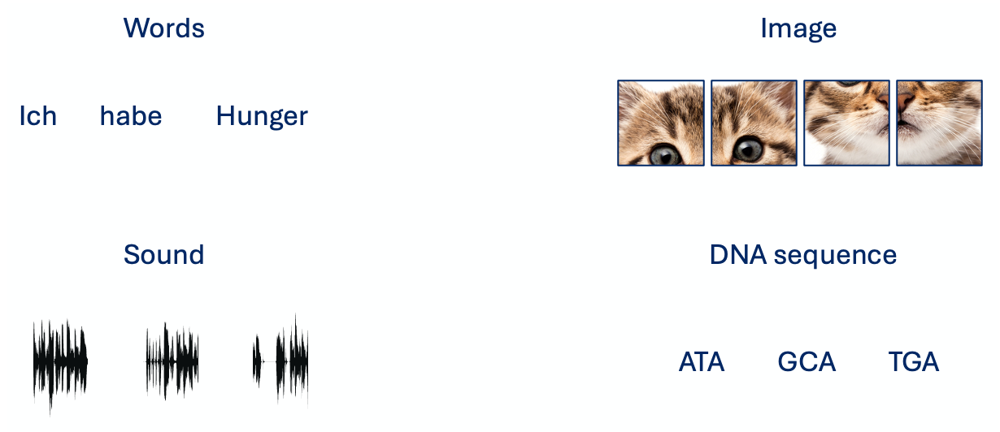

- **Architecture-wise:**
    - **Encoder only models:** such as BERT
    - **Decoder only models:** such as GPT
    - **Encoder–decoder models:** the original Transformer design

Word embedding
=========================================

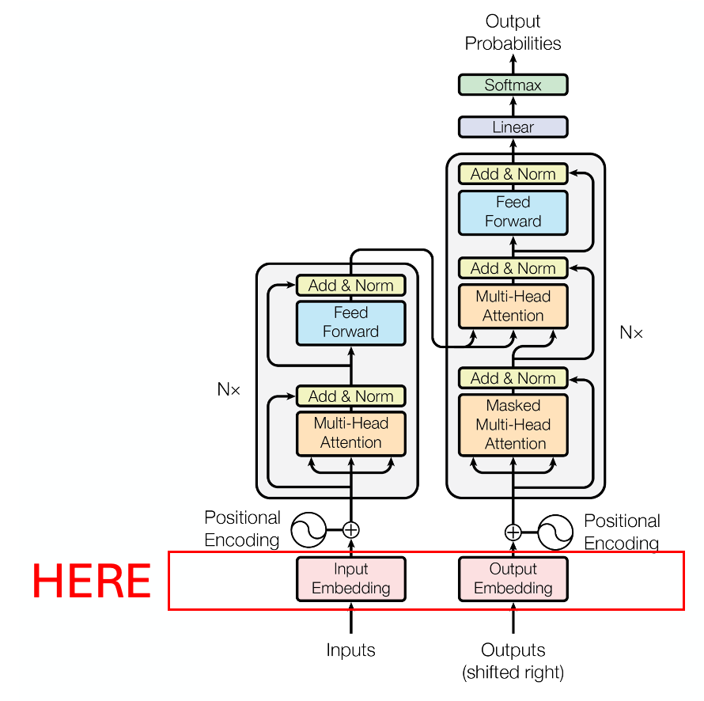

Neural networks, including Transformers, require vector inputs, so words must be converted into vectors. See this video for the introduction to the word embedding.

**Transformer Basic – Word embedding**

.. youtube:: Z7K2uodMnts

**Motivation:** 

- A simple solution: one hot vectors are a simple solution, where each word is represented by a vector with one element set to one and the rest zero.

    - However, one hot encoding does not capture semantic similarity, since related and unrelated words have zero similarity.

- Therefore, we need word representations that encode meaning and relationships between words.

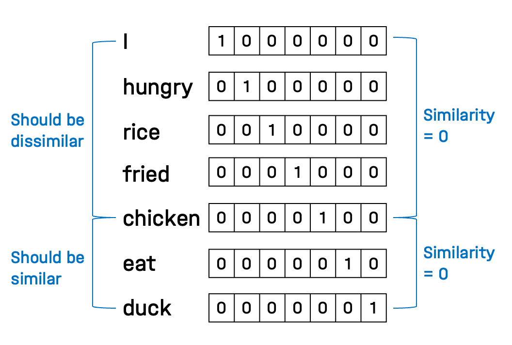

**Method:**

- Word embedding maps words into vectors that capture semantic similarity.
- In a good word embedding, related words are closer, and vector operations can reflect relationships between words.
    
    - e.g., queen - woman + man = king

    .. figure:: ../_figures/word-emb-ex-2.png

- In Transformers, text is first split into smaller chunks using byte pair encoding, then mapped to vectors through a learnable linear layer.

    - Possibly not be the best for some cases, e.g., hun-gry vs hun-ter
    - But it still improves data efficiency and generalization, e.g., walk, walk-ed, walk-ing.

    .. figure:: ../_figures/byte-pair-encoding.png

In this course we simplify the explanation by considering the whole words instead of split tokens as the word embedding.

Positional encoding
=========================================

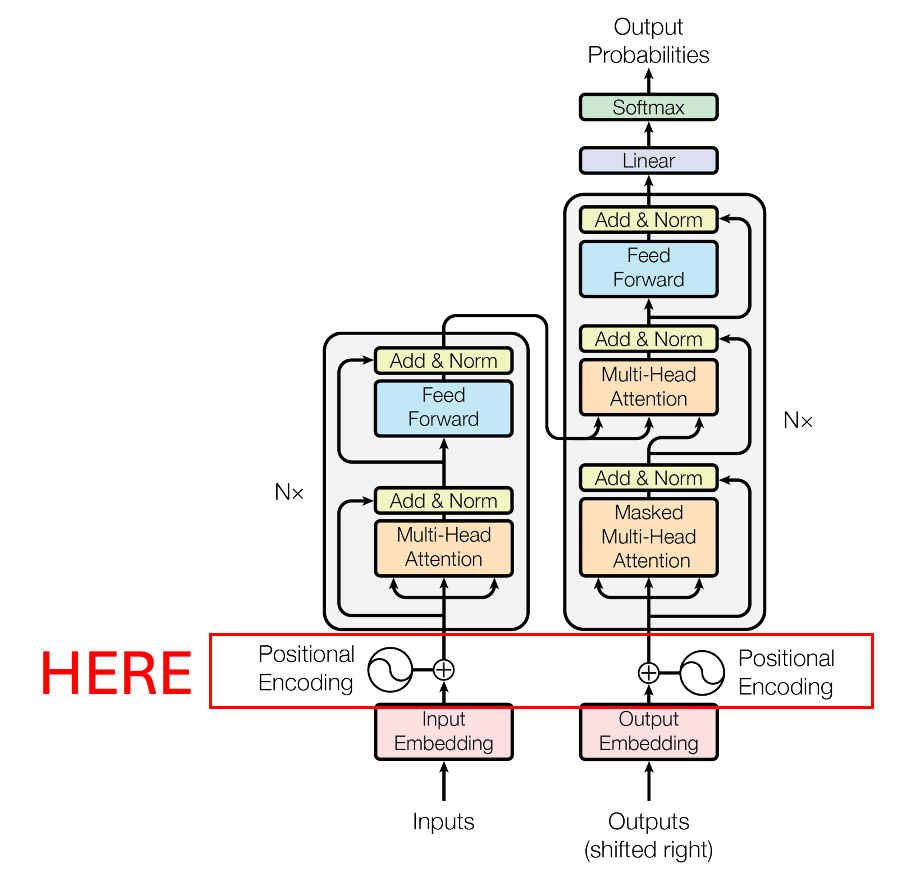

Positional encoding gives word position information to each word embedding. See this video below for an introduction to positional encoding.

**Transformer Basic – Positional encoding**

.. youtube:: 1s_XUBB1RsY

**Motivation:**

- Transformers process all tokens in parallel rather than sequentially.

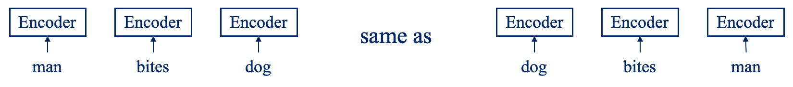

- The self attention mechanism is permutation equivariant, meaning that if we shuffle the input tokens, the outputs are shuffled in the same way.

    - However, the model does not know which word comes first or second as self-attention only compares the content of the tokens with each other, without any information about their positions.

    .. figure:: ../_figures/pos-enc-motivation-2.png

- However, word order changes meaning, for example when the positions of words in a sentence are swapped.

    - e.g., “dog bites man” vs “man bites dog”

- Therefore, Transformers need explicit position information to distinguish different token orders.

**Method:**

- Positional encoding is used to inject positional information to the model. It is a vector added to the word embedding, so it must have the same dimension as the embedding.

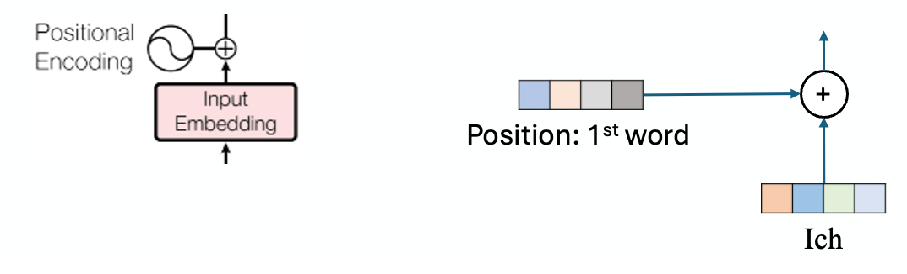

- A simple approach is binary position encoding, although it limits the maximum input length depending on the number of bits.

    - Max input length = 2^{number of bits}. E.g., number of bits = 4 means max input length = 16

    .. figure:: ../_figures/pos-enc-method-2.png

- In the original Transformer, positional encoding uses sine and cosine functions.

    - Sine for even dimension ({2i}-th dimension) and cosine for odd dimension ({2i+1}-th dimension). Therefore, i=0 is for dimension 0 and 1, i=1 is for dimension 2 and 3, and so on if we have more dimension.
    - The equation also based on token/word position (pos) and vector dimension (d).
    - This approach does not impose a fixed maximum position.

    .. figure:: ../_figures/pos-enc-method-3.png

- Another common approach, especially in Vision Transformers, is to use learnable positional embeddings and let the model learn position information during training.

Self-attention
=========================================

Self attention mechanism is the core of transformer model. Self-attention is used in the encoder. In this subsection, we will discuss without the multi-head part.

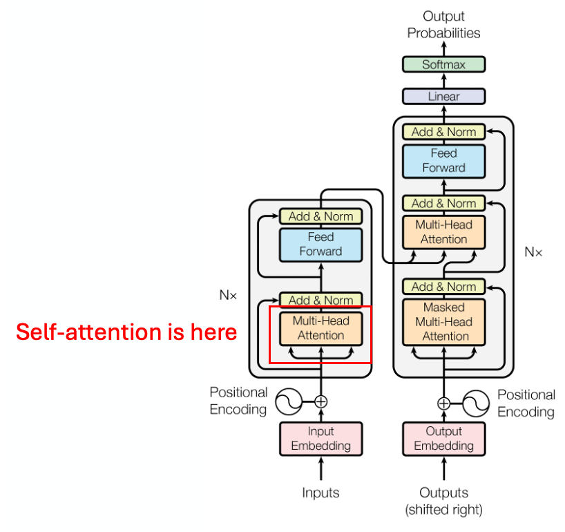

Check the video below for introduction for more details:

**Transformer Basic – Self-attention**

.. youtube:: 6njflIo3BHI

**Motivation:**

- Context is essential for understanding word meaning. A word can have different meanings depending on surrounding words.

    - e.g., “The **bat** flies in the cave.” vs “He swings the **bat**.”
- Without considering other tokens in the sequence, the correct interpretation of a word cannot be determined.
- Self attention allows each word to look at other words in the sequence to gather contextual information.

**Intuition:**

- Each word tries to find which other words are important to it.
- Example #1, the word “bat”

    - In the sentence “the bat flies in the cave,” the word “bat” is connected to “flies” and “cave,” indicating it refers to an animal.
    - In the sentence “he swings the bat,” the word “bat” is connected to “swings” and “he” (a person), indicating it refers to a sports object.

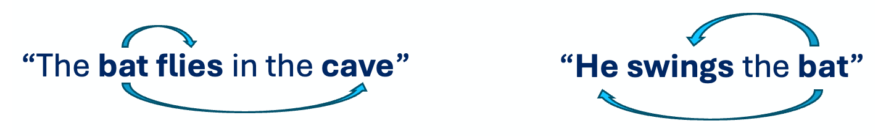

- Example #2, the word “it”

    - In the sentence “I poured water into the cup until it was full,” “it” refers to “cup,” due to connection with something is “poured” “into” “until” “full”
    - In the sentence “I poured water from the bottle until it was empty,” “it” refers to “bottle,” due to connection with something is “poured” “from” “until” “empty”

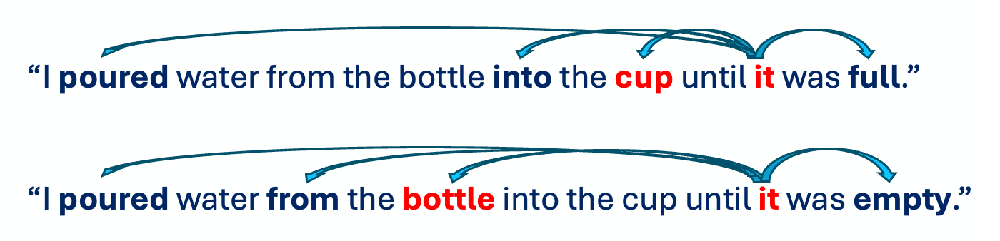

- These connections between words help determine meaning, and self attention captures these relationships.

**Self Attention Mechanism:**

1. All word vectors are first combined into a matrix.
2. This matrix is multiplied by three learnable weight matrices to produce **query**, **key**, and **value** vectors.

    - Matrix multiplication is used instead of processing vectors one by one, allowing all tokens to be processed in parallel.

    .. figure:: ../_figures/self-att-mech-1.png

3. Each query is multiplied by the transposed keys to compute similarity scores using dot products.
4. The scores are normalized by the square root of the vector dimension, then passed through softmax to obtain attention weights.

    .. figure:: ../_figures/self-att-mech-2.png

5. These attention weights are multiplied with the value vectors and summed to produce updated word representations that incorporate context.

    .. figure:: ../_figures/self-att-mech-3.png

**Query, Key, Value Intuition:**

- **Query:** represents the word we are focusing on and asking what is relevant to it.
- **Key:** represents all words that compete for attention/relevancy with respect to the query.

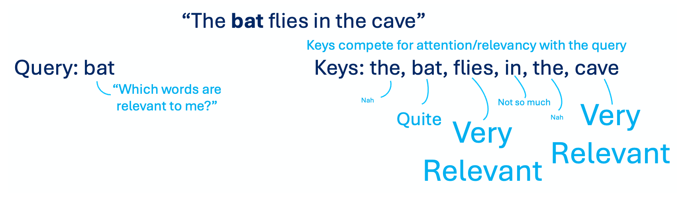

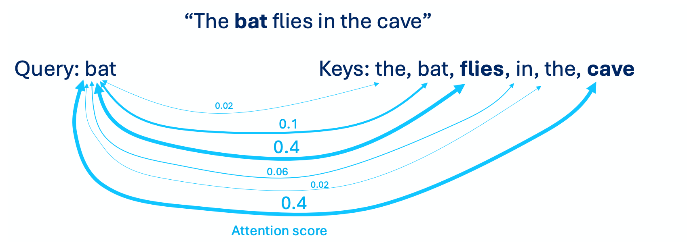

- **Value:** contains the actual information of each word that will be aggregated, weighted by the attention score

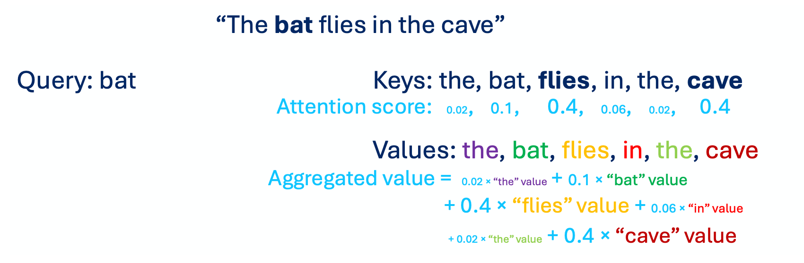

Masked self-attention and cross-attention
=========================================

In the Transformer decoder, there are two types of attention mechanisms: masked self attention and cross attention. 

- Masked self-attention is the self-attention in the decoder block that masks future words to model relationships between current and past output tokens.
- Cross attention connects the decoder (output of masked self-attention) with the encoder output.

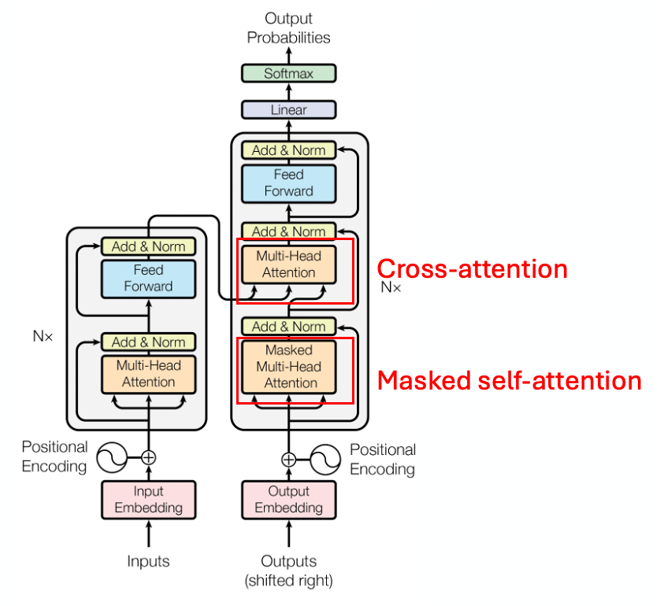

See this video for the introduction to masked self-attention.

**Transformer Basic – Masked self-attention and cross-attention**

.. youtube:: NONly4i_-3Q

**Masked self-attention motivation:**

- In the decoder, future words are not available during test time.
- However, during training, multiple tokens are processed in parallel.
- To simulate real test conditions while keeping training parallelizable, the decoder must prevent access to future tokens.
- This is why masked self attention is used in the decoder.

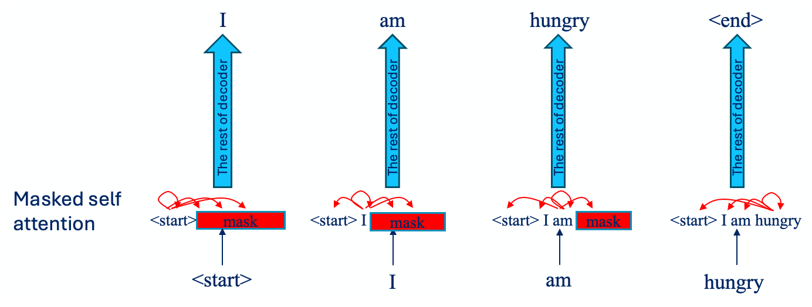

**Masked self-attention mechanism:** 

1. The computation of query, key, and value is the same as in normal self attention.
2. Each query is multiplied with the transposed keys to compute dot product similarity scores between tokens.
3. To mask future tokens, the corresponding dot product values are replaced with negative infinity.
4. After applying softmax, these positions with negative infinity become zero, meaning no attention is given to future tokens.

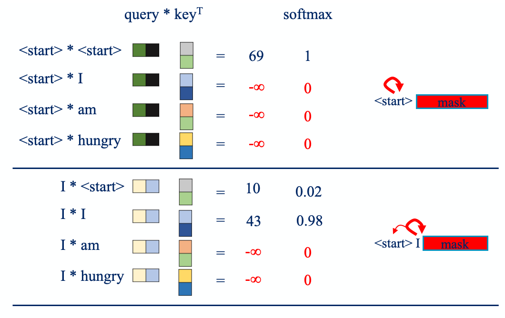

5. The attention weights are then multiplied with the value vectors and summed, producing representations that only incorporate information from the current and previous tokens.

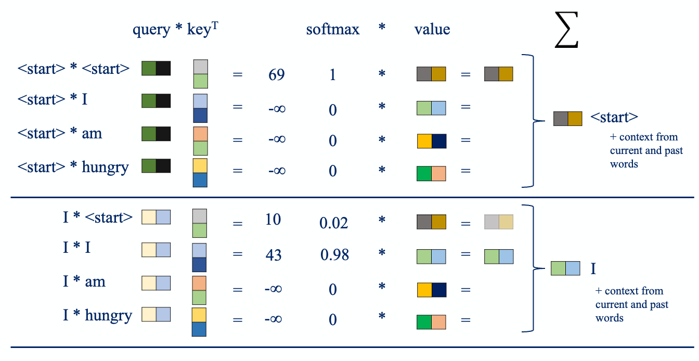

**Cross-attention Mechanism:**

- Takes input from both the decoder and the encoder.
- The **query** comes from the decoder output after masked self attention.
- The **key** and **value** come from the encoder output.
- The decoder uses this mechanism to find which parts of the input sequence are relevant for predicting the next token.
- This allows the model to align and connect information between input and output sequences.

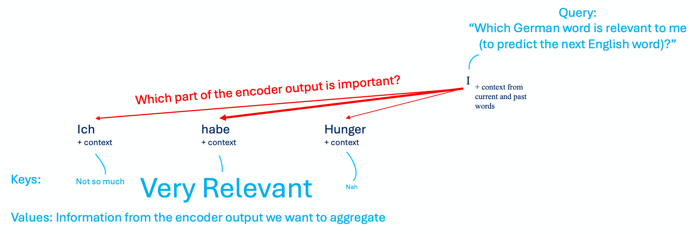

Multi head attention
=========================================

Finally, transformer use multi-head mechanism for all of the attention modules (self-attention, cross-attention, and masked self-attention). In this subsection, we will discuss multi-head self-attention. The concept of multi-head is transferable to other attention mechanisms.

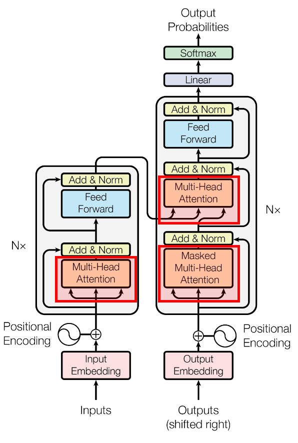

Refer to the video below for more details.

**Transformer Basic – Multi head attention**

.. youtube:: 99100CbBsck

**Motivation:**

- Instead of relying on a single attention mechanism, multiple attention modules run in parallel.
- This allows the model to capture different types of relationships between tokens, since each attention head can focus on different aspects of the input.

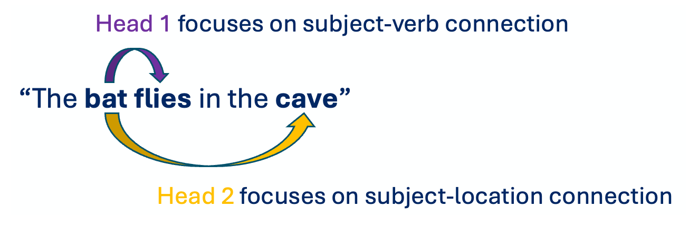

- In the original Transformer, eight attention heads were used.

**Mechanism:**

1. Each attention head has its own separate weight matrices for query, key, and value, and these weights are not shared across different heads.
2. The attention operations are performed independently in parallel.
3. The outputs from all attention heads are concatenated.
4. The concatenated result is then multiplied by a learnable output weight matrix.
5. The output weight matrix maps the concatenated features back to the original input dimension, ensuring the final output has the same size as the input, which is required for the residual connection.

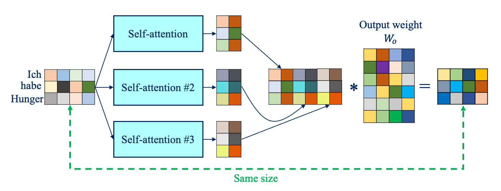

Putting them all together
=========================================

After understanding the individual components, we will put them together. Please watch the video below:

**Transformer Basic – Putting them all together**

.. youtube:: SE6CH0plnW0

Transformer can be seen as a combination of preprocessing, encoder, decoder, and output layers working together.

- The input and the right-shifted output sequence are first converted using **word embedding** and **positional encoding**.
- The **encoder** processes the input into a context rich representation.
- The **decoder** uses encoder’s representation along with previously generated tokens.
- **Output layers** process decoder’s output through a linear layer and softmax to produce the translated sentence.

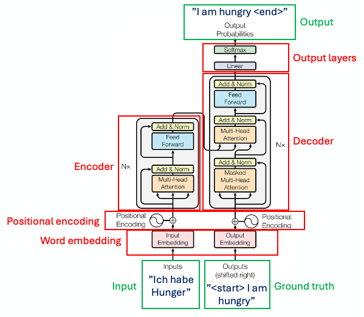

**Encoder flow:**

- Input (word) embeddings with positional encoding are fed into the encoder.
- Multi head self attention captures relationships between all tokens.

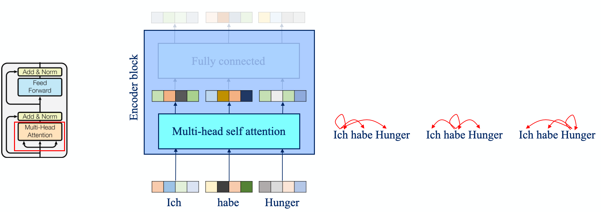

- A feed forward layer processes each token independently with shared weights.

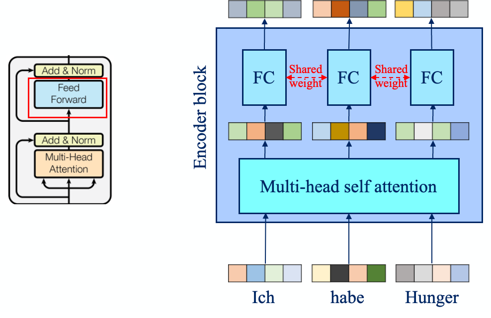

- Residual connections with normalization are applied to stabilize training, especially for deeper network.

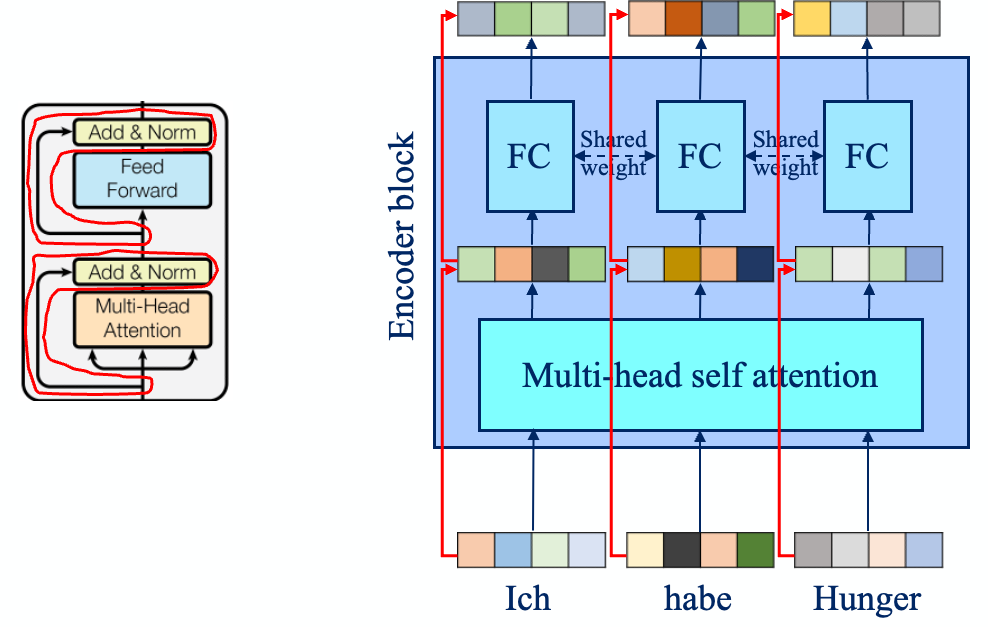

- This process can be stacked across multiple encoder blocks.

**Decoder flow:**

- The shifted output sequence (during training, with <start> token) or previous decoder output (during testing) is used as input.
- Masked multi head self attention captures relationships between current and past tokens only, despite having the full ground truth sentence.

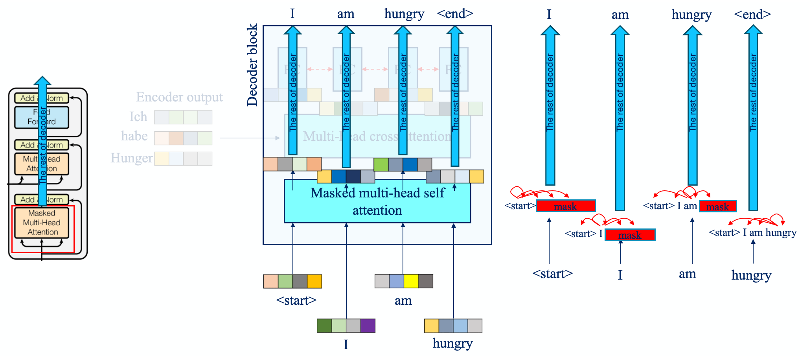

- Multi head cross attention connects the decoder with the encoder output.

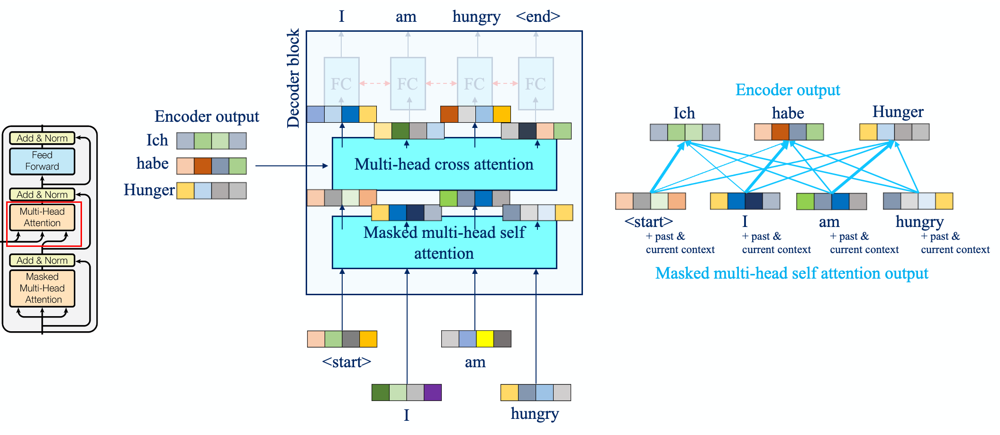

- A feed forward layer and residual connections with normalization are applied.

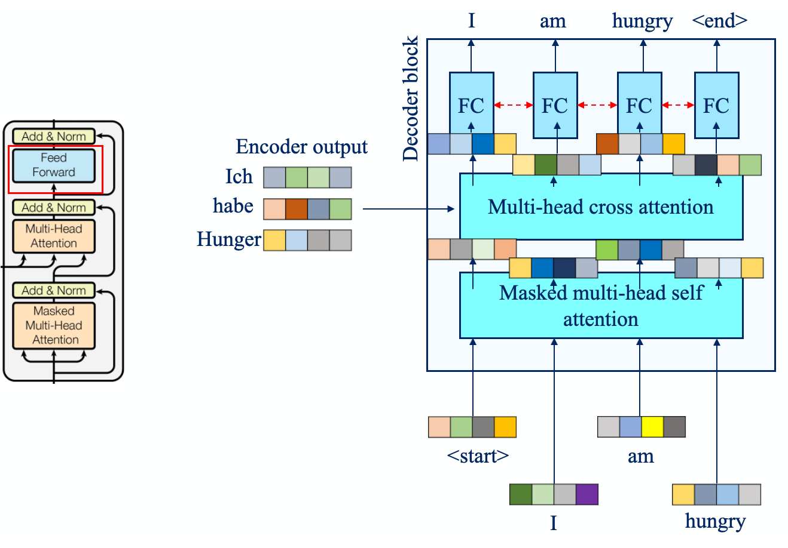

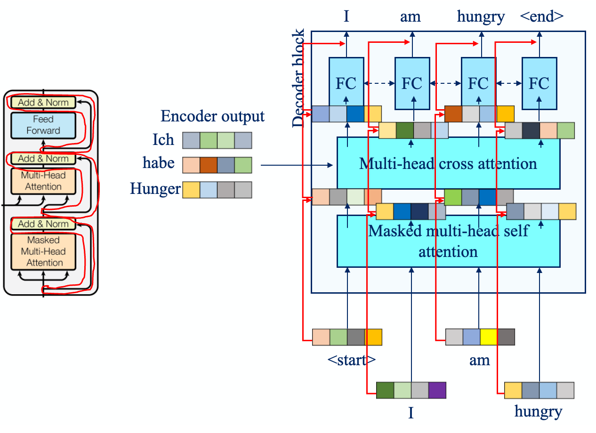

- This process is also repeated across multiple decoder blocks.

Transformer extension
=========================================

Beyond the original transformer used for machine translation, there are methods extending the concept of transformer to other tasks.

Bidirectional Encoder Representations from Transformers (BERT)
--------------------------------------------------------------

BERT, which stands for Bidirectional Encoder Representations from Transformers, was introduced in 2019 by Devlin et al. Unlike the original Transformer that consists of both encoder and decoder for machine translation, BERT uses only the encoder and is designed to produce representations that can be applied to many downstream tasks such as classification. The term bidirectional means that BERT can attend to both past and future words using self attention, allowing it to capture context from both directions. 

Below is the introduction to BERT.

**Transformer Basic – Bidirectional Encoder Representations from Transformers (BERT)**

.. youtube:: s0OQoRuNPTg

**Key characteristics:**

- Uses only the Transformer encoder without a decoder.
- Introduces a learnable classification token that aggregates information from the whole input sequence using self attention.
- The classification token can be used for tasks such as sentiment analysis or spam detection by attaching a classification layer on top.

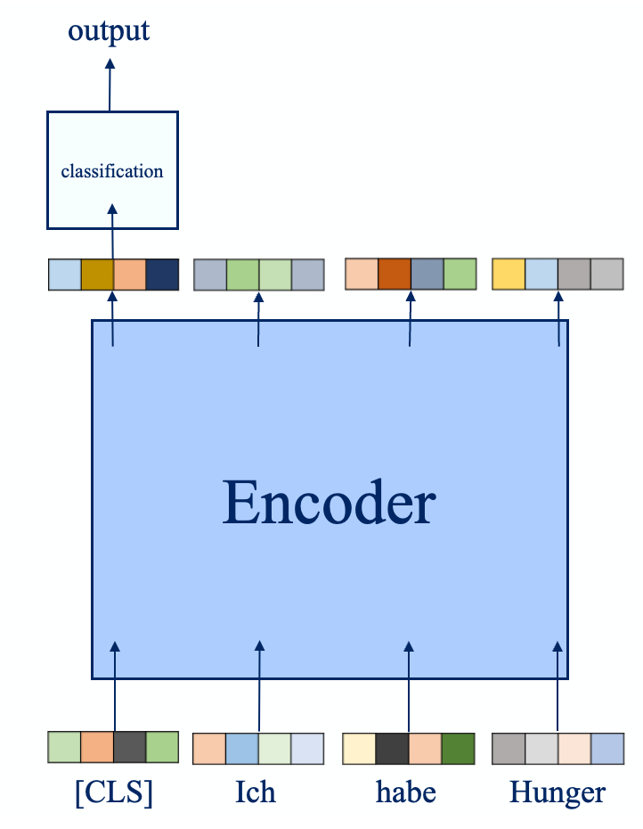

- Adds segment embedding in addition to word/token embedding and positional embedding, to indicate which sentence a token belongs to when multiple sentences are used as input.

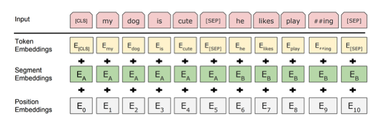

**Training strategy:**

- Training consists of two stages: pre training and fine tuning.

    .. figure:: ../_figures/bidir-enc-training-1.png

    - First stage: the encoder is trained using self supervised pretext tasks. Examples of pretext task:
        - Masked language modeling, where a portion of the input tokens are replaced with a mask token and the model must predict the original words.

        .. figure:: ../_figures/bidir-enc-training-2.png

        - Next sentence prediction, where the model learns whether two sentences are logically connected.

        .. figure:: ../_figures/bidir-enc-training-3.png

    - Second stage: a task specific layer is added for downstream tasks, and either only this layer or the entire model can be fine tuned.

Vision Transformer (ViT)
=========================================

Vision Transformer, or ViT, was proposed in the 2021 paper *An Image is Worth 16x16 Words: Transformers for Image Recognition at Scale*. It extends the original Transformer architecture to image inputs, adapting the design to work for image classification tasks.

See the video below for introduction to ViT.

**Transformer Basic – Vision Transformer (ViT)**

.. youtube:: sx1iiDDpbyI

**Key differences from the original Transformer:**

- Uses only the **encoder**, since image classification does not require a decoder.
- Replaces word tokens with **image patches**, which are treated as input tokens.

    - Patch size is a **hyperparameter**, for example 16 by 16 patches for a 224 by 224 image in the original paper.
- Adds a **learnable class token [CLS]** to the input sequence, which is used for final classification.

    - The self attention of [CLS] will see global feature of the image

    .. figure:: ../_figures/vis-transformer-1.png

- Converts each patch into an embedding using a linear projection of flattened patches, instead of word embedding lookup.

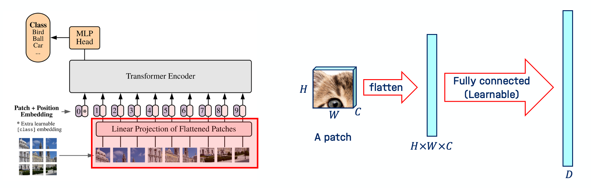

- Positional encoding is a vector added to the patch embedding and it is learnable (instead of sinusoidal function used in original transformer). It represents the spatial position of the patch. 

**Why it works for image classification:**

- A single patch may not contain enough information to identify an object.
- Through self attention, each patch can attend to other patches and gather global context.
- The class token attends to all patches and aggregates their information into a global feature representation for classification.

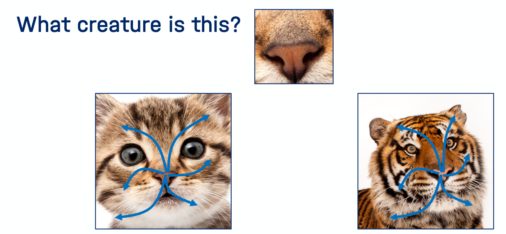

References:
=========================================

BERT paper: Devlin, J., Chang, M.W., Lee, K. and Toutanova, K., 2019, June. Bert: Pre-training of deep bidirectional transformers for language understanding. In *Proceedings of the 2019 conference of the North American chapter of the association for computational linguistics: human language technologies, volume 1 (long and short papers)* (pp. 4171-4186).

**Blogpost on Attention mechanism**

https://towardsdatascience.com/an-intuitive-explanation-of-self-attention-4f72709638e1

https://towardsdatascience.com/illustrated-self-attention-2d627e33b20a

https://ai.stackexchange.com/questions/23889/what-is-the-purpose-of-decoder-mask-triangular-mask-in-transformer

**Blogpost on word embedding**

https://www.baeldung.com/cs/convert-word-to-vector

https://pytorch.org/tutorials/beginner/nlp/word_embeddings_tutorial.html

**Blogpost/video on transformer**

https://www.youtube.com/watch?v=z1xs9jdZnuY

**Blogpost on positional encoding**

https://kazemnejad.com/blog/transformer_architecture_positional_encoding/

https://timodenk.com/blog/linear-relationships-in-the-transformers-positional-encoding/

**Blogpost on BERT**

https://jalammar.github.io/illustrated-bert/

https://medium.com/carbon-consulting/bert-encoder-stack-is-all-you-need-f1483cfe2e07

https://www.analyticsvidhya.com/blog/2021/05/all-you-need-to-know-about-bert/

https://d2l.ai/chapter_natural-language-processing-applications/finetuning-bert.html
