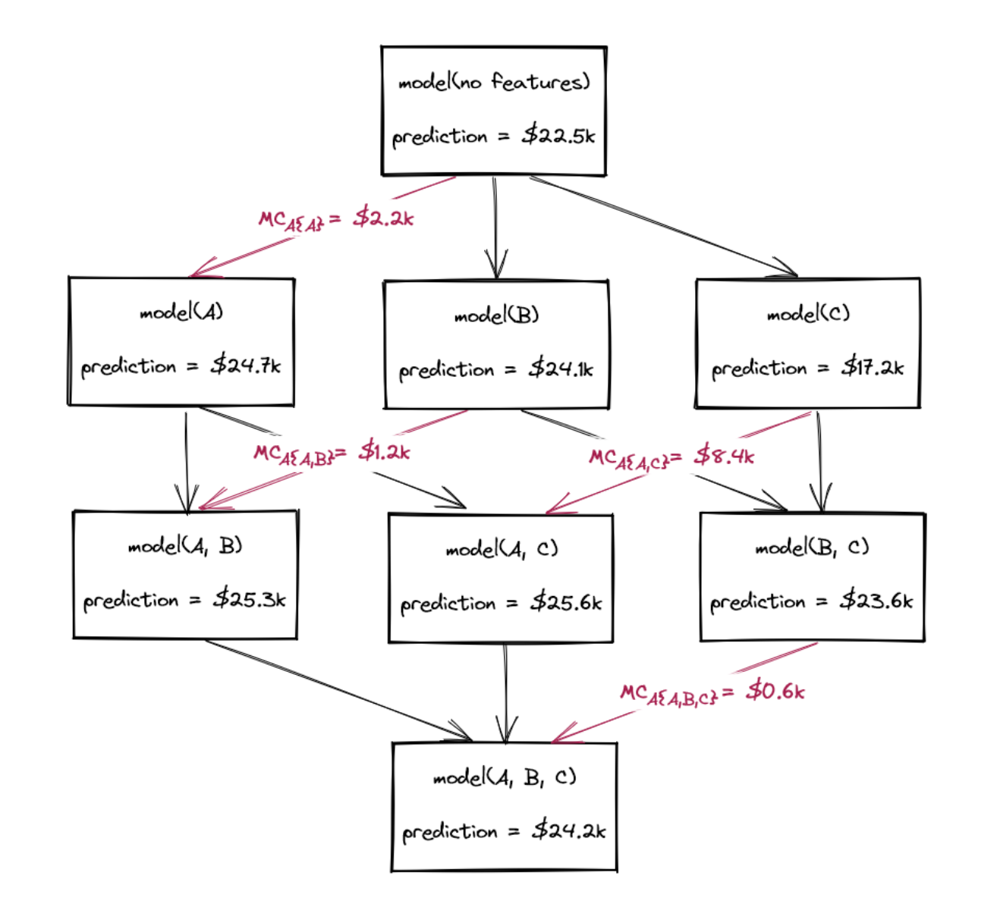
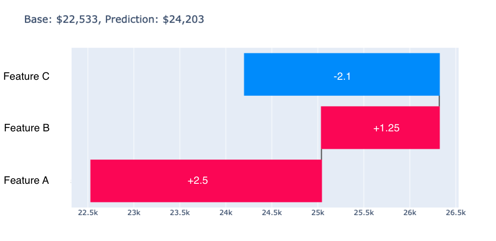

Introduction to SHapley Additive exPlanations (SHAP)
=====================================================

SHapley Additive exPlanationsis a **model-agnostic** method, which means that it is not restricted to a certain model type, 
and it is a **local** method which means that it only provides explanations for individual samples. 
However, the individual explanations can be used to also get **global** interpretations. SHAP was introduced in 2017 by `Lundberg et al. <https://proceedings.neurips.cc/paper/2017/hash/8a20a8621978632d76c43dfd28b67767-Abstract.html>`_

For a short video introduction to SHAP, click below:

.. vimeo:: 745352008?h=3168320cef

    Short video lecture on the principles of SHAP.

To summarize, SHAP is a method that enables a fast computation of Shapley values and can be used to explain the prediction of an instance x 
by computing the contribution (Shapley value) of each feature to the prediction. We get contrastive explanations that compare the prediction with the average prediction. 
The fast computation makes it possible to compute the many Shapley values needed for the global model interpretations. 
With SHAP, global interpretations are consistent with the local explanations, since the Shapley values are the “atomic unit” of the global interpretations. 
If you use LIME for local explanations and permutation feature importance for global explanations, you lack a common foundation. 
SHAP provides KernelSHAP, an alternative, kernel-based estimation approach for Shapley values inspired by local surrogate models, as well as TreeSHAP, an efficient estimation approach for tree-based models. 

How to compute Shapley Values
------------------------------------

Introduction
^^^^^^^^^^^^^^^^^^^^^^^^^^^

During the course, we introduced the concept of Shapley values and said that due to the great amount of calculation needed for big data sets with several features, an efficient way of computing them is needed, and for this, the SHAP library comes to help. Before seeing how many calculations are needed with an example, let's review the main concepts.

To summarize, focusing on a specific instance *j*, we can compute the Shapley value for each feature *k = 1, ..., K*. Let's choose feature *A* (a player in game theory) and compute the Shapley values, :math:`\phi_A`, as the weighted sum of the **marginal contributions** on different sets *s*:

.. math::

    \phi(x_A) = \sum_{s \in S} w_s \phi_s(x_A)

where the marginal contributions are the difference between the prediction on a subset containing the feature of interest, :math:`f(s_{+x_A})`, and on the subset without that feature :math:`f(s_{-x_A})`:

.. math::

    \phi_s(x_A) = f(s_{+x_A}) - f(s_{-x_A})

For the weights we need to consider that the larger and smaller set have the highest weight [#weights]_

To calculate each of those marginal contributions, we're required to determine the predicted value across all potential feature subsets. This necessitates computing the prediction a total of :math:`2^K` times, considering every possible combination of features. Theoretically, model retraining for each subset is necessary, but SHAP approximates these predictions by leveraging the model trained on the entire set. Indeed, we can use this model to run inference on various coalitions by manipulating feature values—often by shuffling or altering them—and estimate the impact of different feature subsets without the need for full retraining.

Once we compute the Shapley value for each feature *k*, we can use them to understand the impact they have on the prediction for the specific instance *j* we are focusing on. Moreover, a very important property of the Shapley values is that they add to the difference between the model prediction (with all the features, and the baseline), giving a way to estimate how each feature contributes to deviating the prediction compared to the baseline:

.. math::

    f(j) - \mu(f(J)) = \sum_{k \in K} \phi(x_A) + ... + \phi(x_K)

where :math:`f(j)` is the prediction for the instance (the one considering all the available features) and :math:`\mu(f(J))` is called **baseline**, i.e. the prediction computed when all features are excluded. In a tabular data set it is often computed as the average prediction among all the instances in the data set. In practical situations, because of numerous approximations, the property may not be entirely fulfilled.

To check if we completely understand the Shapley values, let's compute them in the context of a really small data set. Try to solve the following exercise [#exercise]_

Exercise Description
^^^^^^^^^^^^^^^^^^^^^^^^^^^

You are working with a simplified version of the Boston housing data set [#boston]_ that collects information about the percentage of the population that is working class, the number of rooms, and the nitric oxides concentration (parts per million) of a house. For simplicity, we will call the features A, B, and C. Table 1 shows a small example of the dataset.

.. list-table:: Feature description
   :header-rows: 1

   * - **Instance**
     - **Feature A**
     - **Feature B**
     - **Feature C**
   * - house_1
     - 10.0
     - 6.50
     - 0.5
   * - house_2
     - 21.0
     - 6.22
     - 0.6
   * - house_3
     - 39.5
     - 5.34
     - 0.5
   * - house_4
     - 24.7
     - 6.23
     - 0.69

Let's imagine you trained a machine learning model to predict the house price (regression problem) and you want to explain the results. Specifically, you want to understand which features are impacting your new prediction. Considering that you trained the model and you are able to run inference, you can have the value of the prediction for all the combinations of features (we exclude features by shuffling them); the values of the prediction on all the possible subsets for features are summarized in Figure 1.

.. admonition:: Task
   :class: note

   Compute the Shapley value for the instance *house_1*, :math:`\phi(house_1)`.

   Values of inference for different feature combinations.

Solution
^^^^^^^^^^^^^^^^^^^^^^^^^^^

Let's compute the Shapley value for each feature and the first instance *house_1*, knowing that the model prediction is :math:`f(house_1) = 24.2~K\$`, and this corresponds to the prediction made considering all the available features (model(A, B, C)).

**Feature A**

We compute all the marginal contributions first:

.. math::

    \phi_{s_1}(A) = f(m(A, B, C)) - f(m(B, C)) = (24.2 - 23.6)~K\$ = 0.6~K\$
    \\
    \phi_{s_2}(A) = f(m(A, B)) - f(m(B)) = (25.3 - 24.1)~K\$ = 1.2~K\$
    \\
    \phi_{s_3}(A) = f(m(A, C)) - f(m(C)) = (25.6 - 17.2)~K\$ = 8.4~K\$
    \\
    \phi_{s_4}(A) = f(m(A)) - f(m(\{\})) = (24.7 - 22.5)~K\$ = 2.2~K\$

Thus:

.. math::

    \phi(A) = \frac{1}{3} \times 0.6 + \frac{1}{6} \times 1.2 + \frac{1}{6} \times 8.4 + \frac{1}{3} \times 2.2 = 2.5~K\$

where the sets *s₁* and *s₄* have higher weights (1/3 each).

**Feature B**

Similarly:

.. math::

    \phi_{s_1}(B) = (24.2 - 25.6)~K\$ = -1.4~K\$
    \\
    \phi_{s_2}(B) = (25.3 - 24.7)~K\$ = 0.6~K\$
    \\
    \phi_{s_3}(B) = (23.6 - 17.2)~K\$ = 6.4~K\$
    \\
    \phi_{s_4}(B) = (24.1 - 22.5)~K\$ = 1.6~K\$

Thus:

.. math::

    \phi(B) = \frac{1}{3} \times (-1.4) + \frac{1}{6} \times 0.6 + \frac{1}{6} \times 6.4 + \frac{1}{3} \times 1.6 = 1.2\overline{3}~K\$

**Feature C**

Similarly:

.. math::

    \phi_{s_1}(C) = (24.2 - 25.3)~K\$ = -1.1~K\$
    \\
    \phi_{s_2}(C) = (25.6 - 24.7)~K\$ = 0.9~K\$
    \\
    \phi_{s_3}(C) = (23.6 - 24.1)~K\$ = -0.5~K\$
    \\
    \phi_{s_4}(C) = (17.2 - 22.5)~K\$ = -5.3~K\$

Thus:

.. math::

    \phi(C) = \frac{1}{3} \times (-1.1) + \frac{1}{6} \times 0.9 + \frac{1}{6} \times (-0.5) + \frac{1}{3} \times (-5.3) = -2.1\overline{3}~K\$

Putting everything together:

.. math::

    f(house_1) = f(m(\{\})) + \phi(A) + \phi(B) + \phi(C) = (22.5 + 2.5 + 1.25 - 2.1)~K\$ = 24.1~K\$

We can conclude that features *A* and *B* contribute positively (increasing predicted value), while feature *C* contributes negatively (reducing the prediction).

   SHAP values plotted in red (positive contributions) and blue (negative contributions).

Footnotes
^^^^^^^^^^^^^^^^^^^^^^^^^^^

.. [#weights] For more detail on how the weights are computed, watch: https://www.youtube.com/watch?v=UJeu29wq7d0
.. [#exercise] Exercise is adapted from: https://www.aidancooper.co.uk/how-shapley-values-work/
.. [#boston] Data set link: https://www.cs.toronto.edu/~delve/data/boston/bostonDetail.html?xgtab=&ref=aidancooper.co.uk

References
-----------

- **Original SHAP paper:** Lundberg, S. M., & Lee, S. I. `A unified approach to interpreting model predictions. <https://proceedings.neurips.cc/paper/2017/hash/8a20a8621978632d76c43dfd28b67767-Abstract.html>`_ NeurIPS. 2017
- **Intro to TreeExplainer:** Lundberg, S. M., Erion, G., Chen, H., DeGrave, A., Prutkin, J. M., Nair, B., ... & Lee, S. I. `From local explanations to global understanding with explainable AI for trees. <https://doi.org/10.1038/s42256-019-0138-9>`_ Nature machine intelligence. 2020.
- **Intro to TreeExplainer accelerated with GPUs:** Mitchell, R., Frank, E., & Holmes, G. `GPUTreeShap: massively parallel exact calculation of SHAP scores for tree ensembles. <https://doi.org/10.48550/arXiv.2010.13972>`_ arxiv. 2022
- **Intro to Integrated Gradients:** Sundararajan, M., Taly, A., & Yan, Q. `Axiomatic attribution for deep networks. <https://doi.org/10.48550/arXiv.1703.01365>`_ PMLR. 2017.
- **Visualizing the Impact of Feature Attribution Baselines:** `blog post <https://distill.pub/2020/attribution-baselines/>`_
- **XAI Book with focus on SHAP:** Molnar, C. `Interpreting Machine Learning Models With SHAP. <https://leanpub.com/shap>`_ 2022
- **XAI Book:** Molnar, C. `Interpretable Machine Learning: A Guide for Making Black Box Models Explainable. <https://christophm.github.io/interpretable-ml-book/>`_ Lulu.com. 2022.
