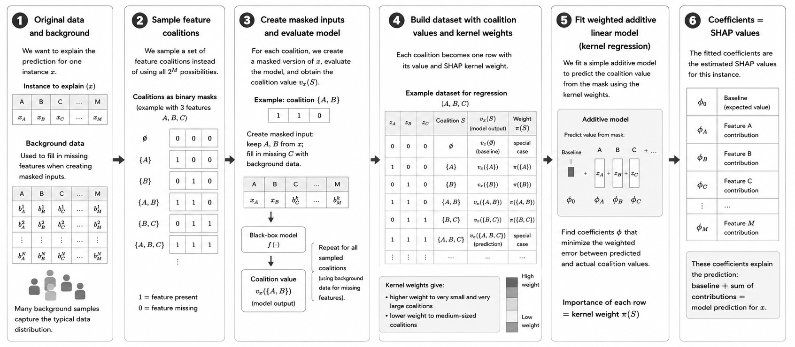
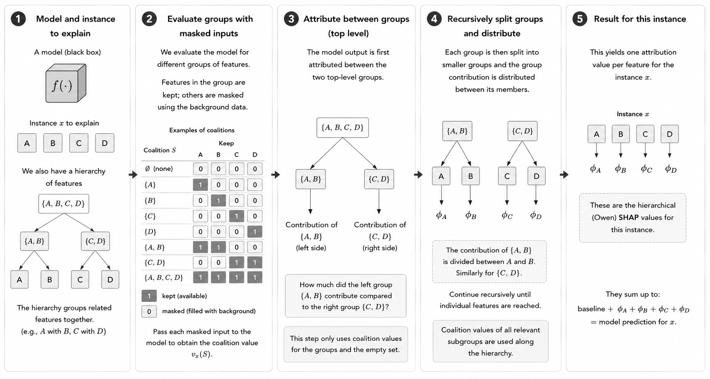
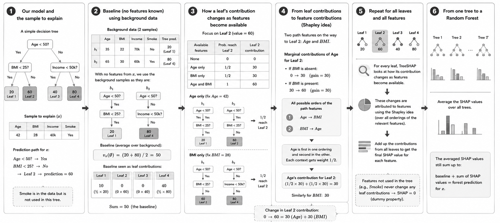

Computing SHAP Values
=====================

So far, we have learned **what SHAP values represent**: feature contributions that explain the difference between a baseline and an individual prediction.

However, SHAP itself is an **attribution framework, not a single algorithm**. Computing feature attributions requires evaluating an underlying cooperative game, which can become computationally expensive because the number of possible feature coalitions grows exponentially with the number of features. Different **SHAP explainers** use different computational strategies to make this attribution problem feasible. Some explainers are **model-agnostic** and treat the model as a black box, while others are **model-specific** and exploit the internal structure of particular model types.

Importantly, not every explainer necessarily computes the same type of attribution. Most SHAP explainers target **Shapley values**, where features can form unrestricted coalitions. If the cooperative game is constrained by a hierarchy of feature groups, the corresponding feature attributions are **Owen values** instead. Owen values are not approximations of Shapley values. They solve a different, hierarchically constrained attribution game. Each feature still receives an individual contribution and the contributions still add up to the difference between the baseline and the model output, but the values can differ from ordinary Shapley values because the allowed feature coalitions are different.

Which attribution is computed can depend not only on the explainer but also on the **masker** used to define the cooperative game. For example, ``ExactExplainer`` can compute ordinary Shapley values with an unrestricted masker or Owen values when a hierarchical clustering constrains the game. ``PartitionExplainer`` is specifically designed for such hierarchical attribution problems.

Available SHAP Explainers
^^^^^^^^^^^^^^^^^^^^^^^^^

As of **August 2026**, the current SHAP API provides the following main explainers. The table focuses on explainers that compute or approximate Shapley- or Owen-based feature attributions; the API additionally contains utility explainers for other attribution methods.

.. list-table:: Main explainers available in the SHAP API
   :header-rows: 1
   :widths: 24 22 18 36

   * - Explainer
     - Attribution
     - Model-agnostic?
     - Applicable models
   * - ``KernelExplainer``
     - Shapley values (approximate)
     - Yes
     - Any model or prediction function
   * - ``PermutationExplainer``
     - Shapley values (approximate)
     - Yes
     - Any model or prediction function
   * - ``SamplingExplainer``
     - Shapley values (approximate)
     - Yes
     - Any model or prediction function
   * - ``ExactExplainer``
     - Shapley or Owen values (exact)
     - Yes
     - Any model or prediction function; practical for relatively small
       attribution problems
   * - ``PartitionExplainer``
     - Owen values
     - Yes
     - Any model or prediction function with a hierarchical feature
       partition
   * - ``TreeExplainer``
     - Shapley values
     - No
     - Supported tree-based models and tree ensembles
   * - ``LinearExplainer``
     - Shapley values
     - No
     - Linear models
   * - ``AdditiveExplainer``
     - Shapley values
     - No
     - Generalized additive models
   * - ``DeepExplainer``
     - Approximate Shapley values
     - No
     - Supported differentiable deep-learning models
   * - ``GradientExplainer``
     - Expected-gradient SHAP approximations
     - No
     - Differentiable models

The general ``shap.Explainer`` interface can automatically select an appropriate algorithm based on the supplied **model and masker**. The algorithm therefore determines how the attribution is computed, while the masker can additionally determine how missing features are represented and whether the cooperative game is unrestricted or hierarchically constrained.

For further details, see the `SHAP Explainer API <https://shap.readthedocs.io/en/latest/api.html#explainers>`__ and `Lundberg et al. (2020) <https://doi.org/10.1038/s42256-019-0138-9>`__.

KernelExplainer
---------------

**KernelExplainer** is a model-agnostic method that approximates SHAP values by evaluating a sample of feature coalitions rather than all :math:`2^M` possible coalitions.

Each sampled coalition is represented by a **binary mask**, where 1 means that a feature is present in the coalition and 0 means that it is treated as missing. For example, for three features :math:`A`, :math:`B`, and :math:`C`, the coalition :math:`\{A,B\}` is represented as :math:`(1,1,0)`. Here, we use abstract features :math:`A`, :math:`B`, and :math:`C` for illustration. The same coalition-mask principle is independent of the input modality; what changes is how missing features are represented when evaluating a coalition. For each sampled coalition, KernelExplainer evaluates the original model to obtain its **coalition value** :math:`v_x(S)`. This creates a new dataset in which the binary coalition masks are the inputs and the corresponding coalition values are the targets. In addition, each coalition receives a **SHAP kernel weight** :math:`\pi(S)` that determines how strongly this coalition influences the subsequent regression. A simplified dataset could therefore look like this:

.. list-table:: Example coalition dataset used by KernelSHAP
   :header-rows: 1
   :widths: 12 12 12 34 30

   * - :math:`z_A`
     - :math:`z_B`
     - :math:`z_C`
     - Target
     - Weight
   * - 0
     - 0
     - 0
     - :math:`v_x(\emptyset)`
     - special case
   * - 1
     - 0
     - 0
     - :math:`v_x(\{A\})`
     - :math:`\pi(\{A\})`
   * - 0
     - 1
     - 0
     - :math:`v_x(\{B\})`
     - :math:`\pi(\{B\})`
   * - 1
     - 1
     - 0
     - :math:`v_x(\{A,B\})`
     - :math:`\pi(\{A,B\})`
   * - 0
     - 1
     - 1
     - :math:`v_x(\{B,C\})`
     - :math:`\pi(\{B,C\})`
   * - 1
     - 1
     - 1
     - :math:`v_x(\{A,B,C\})`
     - special case

KernelExplainer then fits an **additive linear model** to these coalition values:

.. math::

   g(z)=\phi_0+\phi_A z_A+\phi_B z_B+\phi_C z_C

Here, :math:`z_i` indicates whether feature :math:`i` is present in the coalition. The coefficient :math:`\phi_i` will become the estimated SHAP value of feature :math:`i`. The important part is **how this linear model is fitted**. KernelExplainer does not treat every evaluated coalition equally. Instead, it minimizes a **weighted regression error**:

.. math::

   \min_{\phi}\sum_S\pi(S)\left[v_x(S)-g(z_S)\right]^2

**Why Are Kernel Weights Needed?**

The SHAP kernel weight :math:`\pi(S)` controls **how strongly the error for coalition :math:`S` influences the fitted coefficients**. A coalition with a larger weight has a stronger influence on the regression solution than a coalition with a smaller weight. For a coalition :math:`S` with :math:`|S|` present features out of :math:`M` total features, the SHAP kernel weight is

.. math::

   \pi(S)=\frac{M-1}{\binom{M}{|S|}\,|S|\,(M-|S|)}

The weighting gives greater importance to very small and very large coalitions, while the empty and full coalitions are handled specially so that the explanation is anchored at the baseline and the prediction: :math:`g(0,\ldots,0)=v_x(\emptyset)` and :math:`g(1,\ldots,1)=f(x)`. The **SHAP kernel weights connect the linear regression back to the coalition weights in the original Shapley-value calculation**. With many features, the number of possible coalitions is very uneven across coalition sizes. There are only a few very small and very large coalitions, but many more medium-sized coalitions. For example, with 10 features, there are only 10 coalitions containing one feature, but 252 coalitions containing five features. If every coalition were treated equally in the regression, the medium-sized coalitions could dominate simply because there are many more of them. The SHAP kernel weights correct for this combinatorial imbalance: rarer, very small and very large coalitions receive more weight, while the numerous medium-sized coalitions receive less weight. In this way, the weighted regression reflects the coalition weighting required by the original Shapley-value calculation rather than being dominated by the most common coalition sizes. This allows the fitted coefficients :math:`\phi_i` to estimate the SHAP values.

KernelExplainer can therefore approximate SHAP values without explicitly evaluating every possible coalition. However, it still requires repeated evaluations of the original model and can become computationally expensive when the number of features is large.

   **Overview of KernelSHAP.** KernelSHAP samples feature coalitions, evaluates their model outputs, and uses SHAP kernel weights in a weighted linear model to estimate the SHAP values.

PartitionExplainer
------------------

**PartitionExplainer** is a model-agnostic method that uses a **hierarchical structure over the input features** to make the attribution problem more efficient. Like KernelExplainer, PartitionExplainer only requires access to the model's inputs and predictions. However, the two methods reduce the complexity of the attribution problem in fundamentally different ways:

* **KernelExplainer** samples coalitions from the unrestricted Shapley game.
* **PartitionExplainer** uses a hierarchy of related features and restricts the attribution game according to this structure.

Importantly, this means that PartitionExplainer does not simply provide a different approximation algorithm for the same unrestricted Shapley values. When the hierarchy constrains which feature coalitions are considered, the resulting hierarchical feature attributions are **Owen values**.

A Hierarchy of Features
^^^^^^^^^^^^^^^^^^^^^^^

Suppose we have four features :math:`A`, :math:`B`, :math:`C`, and :math:`D`. Based on their structure or similarity, they might be grouped as

.. code-block:: text

                   {A, B, C, D}
                   /          \
               {A, B}          {C, D}
               /   \            /   \
              A     B          C     D

Here, :math:`A` and :math:`B` form one group, while :math:`C` and :math:`D` form another.

The hierarchy is part of the definition of the attribution problem. PartitionExplainer uses this structure to evaluate groups of related features and recursively divide their contributions into smaller groups until individual features are reached. As with other SHAP explainers, evaluating a coalition still requires a **complete model input**. Features that are present retain their information, while features outside the coalition are treated as missing according to the chosen **masker**. The completed input is passed to the original model to obtain the coalition value :math:`v_x(S)`.

The hierarchy therefore does not change what a coalition value means. It changes **which combinations of features are considered when assigning the model output to the individual features**.

From Shapley Values to Owen Values
^^^^^^^^^^^^^^^^^^^^^^^^^^^^^^^^^^

To understand the consequence of introducing a hierarchy, recall how ordinary Shapley values are defined. For the four features

.. math::

   N = \{A,B,C,D\},

an unrestricted Shapley-value calculation treats every feature as an individual player. All possible feature orderings are considered when determining a feature's average marginal contribution. For example, all of the following orderings are allowed:

.. code-block:: text

   A -> B -> C -> D
   A -> C -> B -> D
   C -> A -> D -> B
   D -> B -> A -> C
   ...

Now suppose we introduce the groups

.. code-block:: text

   Group 1: {A, B}
   Group 2: {C, D}

The attribution question changes. We now want the feature attributions to **respect this grouping**. An intuitive way to understand this is to consider the ordering at two
levels:

#. the groups can appear in different orders, and
#. the features within each group can appear in different orders.

For example,

.. code-block:: text

   {A, B} -> {C, D}

with the within-group orderings

.. code-block:: text

   A -> B
   C -> D

gives the complete ordering

.. code-block:: text

   A -> B -> C -> D

Another valid ordering is

.. code-block:: text

   D -> C -> B -> A

because the group :math:`\{C,D\}` appears first, followed by :math:`\{A,B\}`, while the order within each group is also allowed to vary.

In contrast,

.. code-block:: text

   A -> C -> B -> D

does **not** respect the grouping because features from the two groups are interleaved.

The feature attributions obtained by averaging marginal contributions while respecting such a predefined grouping are called **Owen values**.

Shapley Values and Owen Values
^^^^^^^^^^^^^^^^^^^^^^^^^^^^^^

An Owen value is **not an approximation of a Shapley value**. It is the attribution obtained for a different cooperative game: one in which the players are organized into groups. The basic marginal-contribution calculation does not change. For feature :math:`i` joining a coalition :math:`S`, we still ask how much the coalition value changes:

.. math::

   v_x(S \cup \{i\}) - v_x(S).

What changes is **which situations are included when these marginal contributions are averaged**. For an ordinary Shapley value, the contribution of a feature is averaged over all possible feature orderings. For an Owen value, the contribution is averaged over orderings that respect the predefined grouping structure. The distinction can therefore be summarized as follows:

.. list-table:: Shapley values and Owen values
   :header-rows: 1
   :widths: 30 35 35

   * -
     - Shapley value
     - Owen value
   * - Players
     - Individual features
     - Individual features organized into groups
   * - Marginal contribution
     - :math:`v_x(S \cup \{i\}) - v_x(S)`
     - :math:`v_x(S \cup \{i\}) - v_x(S)`
   * - Feature orderings
     - All possible feature orderings
     - Orderings that respect the grouping
   * - Final result
     - One attribution per feature
     - One attribution per feature
   * - Same values?
     - Unrestricted attribution
     - Not necessarily equal to the corresponding Shapley values
   * - Additive decomposition
     - Yes
     - Yes

Thus, PartitionExplainer still ultimately assigns a contribution to each **individual feature**. It does not stop after assigning contributions to the groups.

If we denote the Owen value of feature :math:`i` by :math:`\psi_i`, the individual feature contributions still account for the complete difference between the empty and full coalition:

.. math::

   \sum_i \psi_i
   =
   v_x(N) - v_x(\emptyset).

In the SHAP setting, this means that the familiar additive decomposition is preserved:

.. math::

   f(x)
   =
   v_x(\emptyset)
   +
   \sum_i \psi_i.

The hierarchy therefore changes **how the difference between the baseline and the prediction is distributed among the features**, but not the requirement that the feature contributions explain this complete difference.

Why Use a Hierarchical Attribution Game?
^^^^^^^^^^^^^^^^^^^^^^^^^^^^^^^^^^^^^^^^^

Restricting the coalition game is useful when the input features have a meaningful structure.

For example:

* neighboring pixels in an **image** can form image regions,
* neighboring or related tokens in **text** can form groups of tokens,
* related variables in **tabular data** can be grouped together.

Consider an image containing thousands of pixels. An unrestricted Shapley game allows arbitrary combinations of individual pixels to form coalitions. A hierarchical representation can instead first group nearby pixels into regions and then recursively divide these regions into smaller groups. Similarly, for text, groups of neighboring tokens can be considered together before their contributions are separated further down the hierarchy.

The hierarchy therefore serves two purposes:

* it incorporates a meaningful **structure between the features** into the
  attribution problem, and
* it reduces the number of feature combinations that need to be evaluated,
  making the computation more efficient.

This is why PartitionExplainer is particularly useful for structured and high-dimensional inputs such as images and text.

The Hierarchy Is Part of the Explanation
^^^^^^^^^^^^^^^^^^^^^^^^^^^^^^^^^^^^^^^^^

An important consequence is that the hierarchy is not merely a computational shortcut. It becomes part of the **definition of the attribution game**.

Consider again

.. code-block:: text

   {A, B}       {C, D}

Changing the hierarchy, for example to

.. code-block:: text

   {A, C}       {B, D}

changes which feature orderings and coalitions are allowed. The resulting Owen values can therefore also change. Similarly, an unrestricted Shapley-value explainer and a hierarchical PartitionExplainer do not necessarily produce the same feature attributions, even when they explain the same model and the same instance. A difference between their results should therefore not automatically be interpreted as approximation error. They can be answering **different attribution questions**:

* Shapley values: How should the prediction be attributed when features can form unrestricted coalitions?
* Owen values: How should the prediction be attributed when the predefined feature hierarchy must be respected?

How PartitionExplainer Makes the Computation Efficient
^^^^^^^^^^^^^^^^^^^^^^^^^^^^^^^^^^^^^^^^^^^^^^^^^^^^^^^

PartitionExplainer exploits the hierarchy recursively. Instead of evaluating arbitrary coalitions from the complete set of :math:`2^M` possible feature combinations, it evaluates feature groups according to the partition tree. Conceptually, the computation follows the hierarchy from larger groups toward individual features. The exact hierarchy is typically provided through the **masker**. This is important because the masker does more than specify how missing feature information is represented: for hierarchical explanations, it can also define the grouping structure that constrains the cooperative game.

PartitionExplainer can therefore remain **model-agnostic**. It does not need to inspect the internal architecture of the prediction model; it exploits structure in the **input features and masker** instead.

KernelExplainer vs. PartitionExplainer
^^^^^^^^^^^^^^^^^^^^^^^^^^^^^^^^^^^^^^

The central difference between KernelExplainer and PartitionExplainer is therefore both computational and interpretational:

.. list-table:: KernelExplainer and PartitionExplainer
   :header-rows: 1
   :widths: 50 50

   * - KernelExplainer
     - PartitionExplainer
   * - Model-agnostic
     - Model-agnostic
   * - Samples from the unrestricted coalition space
     - Uses a hierarchical coalition structure
   * - Uses binary coalition masks and a SHAP-weighted linear model
     - Recursively evaluates feature groups according to the hierarchy
   * - Estimates unrestricted Shapley values
     - Computes hierarchical, Owen-value-based feature attributions
   * - Exploits neither model nor feature hierarchy
     - Exploits the hierarchy of the input features
   * - Primarily reduces computation by sampling coalitions
     - Reduces computation by restricting and recursively evaluating the
       coalition structure

PartitionExplainer should therefore not be viewed simply as a faster alternative to KernelExplainer. The hierarchy changes the attribution game, so the two explainers can produce different feature contributions even for the same model prediction.

   **Overview of PartitionExplainer.** PartitionExplainer uses a hierarchy of related features to constrain the attribution game, recursively distributes contributions from feature groups to individual features, and obtains one Owen-value-based attribution per feature.

TreeExplainer
-------------

**TreeExplainer** is a model-specific method for tree-based models that computes SHAP values efficiently by exploiting the tree structure and using dynamic programming to account for many feature coalitions simultaneously, rather than evaluating each coalition separately.

To understand how TreeSHAP works, consider a very small decision tree:

.. code-block:: text

                            Age < 50?
                           /         \
                        Yes           No
                        /              \
                  BMI < 25?         Income < 50k?
                   /    \              /     \
                 Yes    No           Yes      No
                  |      |            |        |
                 20     60           40       80
               Leaf 1  Leaf 2      Leaf 3   Leaf 4

Suppose we want to explain the prediction for the following sample:

.. list-table:: Sample to explain
   :header-rows: 1
   :widths: 20 20 30 30

   * - Age
     - BMI
     - Income
     - Smoke
   * - 42
     - 28
     - 40k
     - Yes

``Smoke`` is an input feature of the model but is not used anywhere in this tree. With all feature values available, the prediction is:

.. code-block:: text

   Age = 42 -> Age < 50? -> Yes
      |
   BMI = 28 -> BMI < 25? -> No
      |
   Leaf 2 = 60

TreeSHAP now has to answer the same question as the Shapley formulation introduced earlier: **How much did each feature contribute to moving the prediction from the baseline to 60?**

Baseline and Leaf Contributions
^^^^^^^^^^^^^^^^^^^^^^^^^^^^^^^^^

As before, the **baseline** is the model output for the empty coalition: :math:`v_x(\emptyset)`. It represents the model output when none of the feature information from the sample being explained is available. The **sample being explained and the background data have different roles**. The sample provides the feature values whose prediction we want to explain, while the background data provides the reference used when feature information is considered missing.

Assume that our background data contains two different samples:

.. list-table:: Background data
   :header-rows: 1
   :widths: 25 12 12 18 15 18

   * - Background sample
     - Age
     - BMI
     - Income
     - Smoke
     - Tree prediction
   * - :math:`b_1`
     - 35
     - 22
     - 70k
     - No
     - 20
   * - :math:`b_2`
     - 65
     - 30
     - 60k
     - Yes
     - 80

For the empty coalition, none of the feature values from the sample being explained are retained. The model is therefore evaluated using the background samples:

.. code-block:: text

   b1 -> Leaf 1 -> 20
   b2 -> Leaf 4 -> 80

The overall baseline is: :math:`v_x(\emptyset) = \frac{20+80}{2} = 50`. Our sample has a prediction of 60, so the SHAP values ultimately have to explain: :math:`60-50=10`.

To understand how TreeSHAP obtains these contributions, it is useful to look at the individual **leaves of the tree**. Under the empty coalition, one of the two background samples reaches Leaf 1 and one reaches Leaf 4. Since each background sample represents :math:`\frac{1}{2}` of our background data, the probability of reaching either Leaf 1 or Leaf 4 under the empty coalition is :math:`\frac{1}{2}`. A leaf's contribution is its **leaf value multiplied by the probability of reaching that leaf**. Therefore,

.. math::

   50
   =
   \underbrace{\frac{1}{2}\cdot20}_{\text{Leaf 1}}
   +
   \underbrace{\frac{1}{2}\cdot80}_{\text{Leaf 4}}
   =
   10+40.

Leaf 2 and Leaf 3 contribute 0 because neither background sample reaches these leaves. Thus, the baseline can also be decomposed into contributions from the individual leaves:

.. math::

   \underbrace{50}_{v_x(\emptyset)}
   =
   \underbrace{10}_{L_1}
   +
   \underbrace{0}_{L_2}
   +
   \underbrace{0}_{L_3}
   +
   \underbrace{40}_{L_4}.

Importantly, these leaf contributions are **not separate baselines**. The overall baseline is still 50. They simply describe how much each leaf contributes to the baseline prediction. When feature information from the sample becomes available, the probabilities of reaching the different leaves can change. TreeSHAP attributes the resulting changes in the model output to the corresponding features.

**Example: Contribution of Leaf 2**

Let's look at how the contribution of **Leaf 2** changes as information about our sample becomes available. Under the empty coalition, neither background sample reaches Leaf 2, so its contribution is: :math:`0\cdot60=0`. When both Age and BMI are available, their values are fixed to those of the sample being explained:

.. code-block:: text

   Age = 42 -> left
   BMI = 28 -> right

The sample therefore reaches Leaf 2 with certainty and its contribution becomes: :math:`1\cdot60=60`. Thus, the contribution associated with Leaf 2 changes by :math:`60-0=60`. How much of this change should be attributed to **Age**, and how much to **BMI**? We use the same Shapley marginal-contribution principle introduced earlier. First, consider the contribution of Leaf 2 for the different combinations of available path features:

.. list-table:: Contribution of Leaf 2 for different available features
   :header-rows: 1
   :widths: 35 35 30

   * - Available features
     - Probability of reaching Leaf 2
     - Leaf 2 contribution
   * - neither Age nor BMI
     - :math:`0`
     - :math:`0`
   * - Age only
     - :math:`\frac{1}{2}`
     - :math:`30`
   * - BMI only
     - :math:`\frac{1}{2}`
     - :math:`30`
   * - Age and BMI
     - :math:`1`
     - :math:`60`

If neither feature is available, the two background samples are used unchanged and neither reaches Leaf 2. If only **Age** is available, Age is fixed to 42 for both background samples. Both therefore enter the left subtree. BMI remains missing and takes its background values:

.. code-block:: text

   Age = 42, BMI = 22 -> Leaf 1
   Age = 42, BMI = 30 -> Leaf 2

One of the two completed inputs therefore reaches Leaf 2, so **Leaf 2's contribution** is :math:`\frac{1}{2}\cdot60=30`.

If only **BMI** is available, BMI is fixed to 28 while Age and the other missing features take their values from the background samples:

.. code-block:: text

   Age = 35, BMI = 28, Income = 70k -> Leaf 2 -> 60
   Age = 65, BMI = 28, Income = 60k -> Leaf 4 -> 80

Again, one of the two completed inputs reaches Leaf 2, so **Leaf 2's contribution** is :math:`\frac{1}{2}\cdot60=30`. The other input reaches Leaf 4 and contributes :math:`\frac{1}{2}\cdot80=40`. Thus, the complete coalition value for :math:`S=\{\text{BMI}\}` is :math:`v_x(\{\text{BMI}\})=30+40=70`. Here, however, we focus only on the **30 contributed by Leaf 2**, because we are illustrating how the feature contributions associated with this particular leaf are calculated. The contributions from the other leaves are handled in the same way and combined later. Finally, when both Age and BMI are available, the sample reaches Leaf 2 with certainty: :math:`1\cdot60=60`.

From Leaf Contributions to SHAP Values
""""""""""""""""""""""""""""""""""""""

We can now calculate the contribution of **Age to Leaf 2**. There are two possible coalition contexts for Age because BMI is the only other feature on this path.

-  If BMI is absent, we compare: :math:`\emptyset\rightarrow\{\text{Age}\}`, giving the marginal contribution :math:`30-0=30`.
-  If BMI is already present, we compare :math:`\{\text{BMI}\}\rightarrow\{\text{Age},\text{BMI}\}`, giving :math:`60-30=30`.

Age's contribution associated with Leaf 2 is therefore :math:`\phi_{\text{Age}}^{(\text{Leaf 2})} = \frac{1}{2}(30) + \frac{1}{2}(30) = 30`.

Why do both contexts receive a Shapley weight of :math:`\frac{1}{2}`? For the two path features Age and BMI, there are only two possible orders:

.. code-block:: text

   Age -> BMI
   BMI -> Age

Age is first in one ordering and second in the other. Therefore, the context in which BMI is absent and the context in which BMI is already present each occur in **one of the two possible orderings** and receive weight :math:`\frac{1}{2}`.

The same calculation for BMI gives :math:`\phi_{\text{BMI}}^{(\text{Leaf 2})} = 30`. Thus, the change in the contribution of Leaf 2 is fully attributed to Age and BMI: :math:`60 = 0 + 30_{\text{Age}} + 30_{\text{BMI}}`. These are **not yet the final SHAP values** of Age and BMI. TreeSHAP also accounts for the other leaves that can become relevant when features are considered present or missing. The leaf-wise contributions are then summed: :math:`\phi_i(x) = \sum_{\text{leaves }L} \phi_i^{(L)}(x)`.

Importantly, TreeSHAP does not only consider the leaf reached by the fully observed sample. For example, when ``Age`` is missing, the right subtree can also become relevant. Therefore, ``Income`` can receive a non-zero SHAP value even though it is not part of the sample's ordinary prediction path.

What About a Feature That Is Never Used?
^^^^^^^^^^^^^^^^^^^^^^^^^^^^^^^^^^^^^^^^^^^

``Smoke`` does not appear in any split of our example tree. Whether ``Smoke`` is available or missing can therefore never change which leaf is reached or the resulting prediction. For every coalition :math:`S`,
:math:`v_x(S\cup\{\text{Smoke}\})=v_x(S)`. Its marginal contribution is always zero, and therefore :math:`\phi_{\text{Smoke}}(x)=0`. This is exactly the **dummy property** of Shapley values.

From One Tree to a Random Forest
^^^^^^^^^^^^^^^^^^^^^^^^^^^^^^^^^

For a Random Forest, TreeSHAP performs this calculation across all trees. Since a Random Forest regressor averages its tree predictions, the corresponding tree-level SHAP values are also averaged:

.. math::

   \phi_i^{RF}(x)
   =
   \frac{1}{T}
   \sum_{t=1}^{T}\phi_i^{(t)}(x).

The resulting SHAP values still satisfy

.. math::

   f_{RF}(x)
   =
   v_x(\emptyset)
   +
   \sum_i\phi_i^{RF}(x).

The calculation is performed separately for every sample we want to explain because SHAP values describe contributions to an **individual prediction**.

How Does TreeSHAP Make This Efficient?
^^^^^^^^^^^^^^^^^^^^^^^^^^^^^^^^^^^^^^^

The calculations above explicitly considered coalitions to illustrate the idea. Doing this for every feature and every possible coalition would again be computationally expensive. TreeSHAP avoids this explicit
enumeration using **dynamic programming**. While traversing the tree, it stores and updates the information required to represent many feature-present and feature-missing cases simultaneously. When it
reaches a leaf, this information is used to calculate the corresponding Shapley-weighted feature contributions. Thus, TreeSHAP computes the same type of marginal contributions without explicitly constructing and
evaluating every feature coalition.

   **Overview of TreeSHAP.** TreeSHAP exploits the structure of tree-based models to efficiently account for features being present or missing and compute their Shapley-based contributions without explicitly evaluating every feature coalition.
