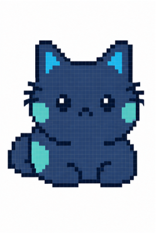
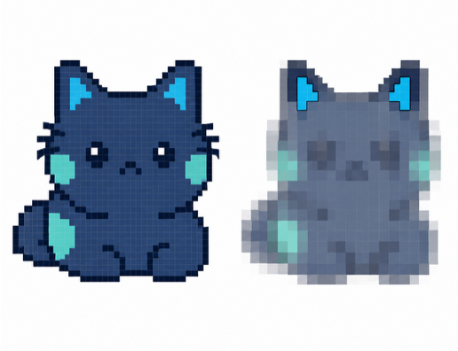
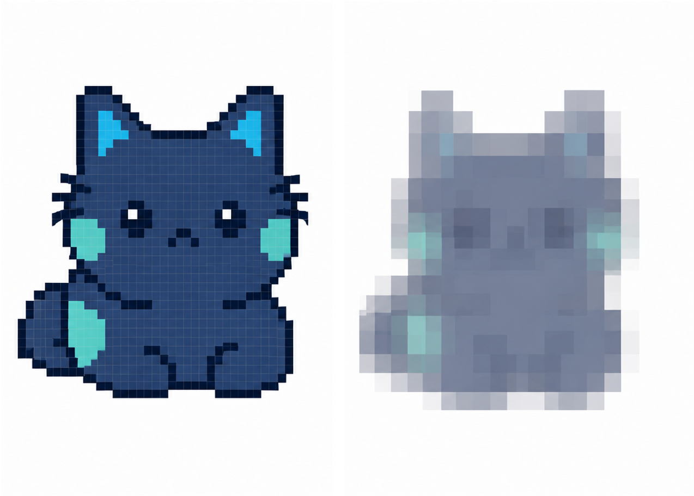

SHAP for Image Data
=====================

We now apply the same SHAP framework to **image data**. Again, the Shapley
formula itself does not change. Instead, we need to define what the players
are, what it means for an image feature to be "missing", and how the
corresponding coalition values :math:`v_x(S)` are evaluated.

What Are the Players?
-----------------------

For image data, the input **pixels** are the players in the Shapley game. A
coalition :math:`S` is therefore a subset of the pixels of the image.

   **Example input image.** For image data, the individual input pixels are the
   players in the Shapley game. SHAP assigns a contribution to each pixel for
   the prediction of the image being explained.

For an image with :math:`M` pixel features, the set of players can be written
as

.. math::

   N = \{p_1, p_2, \ldots, p_M\}.

For an individual image :math:`x`, SHAP assigns a contribution
:math:`\phi_i(x)` to each pixel :math:`p_i`.

As introduced above, the SHAP value of pixel :math:`p_i` is obtained by
combining its marginal contributions across different pixel coalitions:

.. math::

   \phi_i(x) =
   \sum_{S \subseteq N \setminus \{i\}}
   \frac{|S|!(|N|-|S|-1)!}{|N|!}
   \left[
      v_x(S \cup \{i\}) - v_x(S)
   \right].

For a particular coalition :math:`S`, the marginal contribution is

.. math::

   \Delta_{i,x}(S)
   =
   v_x(S \cup \{i\}) - v_x(S).

We therefore determine a pixel's marginal contribution by comparing the
coalition value **with and without that pixel**.

This raises the same practical question as for tabular data: how can we
evaluate :math:`v_x(S)` when pixels outside the coalition cannot simply be
removed from the image?

What Does a "Missing" Pixel Mean?
----------------------------------

Image models generally expect a complete image as input. A pixel outside a
coalition therefore cannot simply be removed. Instead, an **image masker**
defines how the information contained in a "missing" pixel is replaced.

Suppose, for example, that :math:`S` is a coalition containing a subset of
the pixels of image :math:`x`.

Pixels inside the coalition retain their original values, while pixels
outside the coalition are treated as missing:

.. math::

   x_j^{(S)}
   =
   \begin{cases}
      x_j, & p_j \in S,\\
      m_j(x), & p_j \notin S,
   \end{cases}

where

* :math:`x_j` is the original value of pixel :math:`p_j`,
* :math:`m_j(x)` is the replacement value produced by the image masker, and
* :math:`x^{(S)}` is the resulting complete, masked image.

   **Example of an image coalition.** The light-blue pixels form the coalition
   :math:`S` and retain their original values. Pixels outside the coalition are
   treated as missing and replaced according to the image masker, here using
   values from a blurred version of the image.

The model can then be evaluated on this masked image. The corresponding
coalition value is

.. math::

   v_x(S) = f\left(x^{(S)}\right).

Thus, unlike the background-based tabular formulation, a coalition does not
need to be completed using multiple background samples. The image masker
directly constructs a complete image corresponding to the coalition.

Image Masking Strategies
^^^^^^^^^^^^^^^^^^^^^^^^^^

Different masking strategies can be used to represent missing image
information. Two common approaches are **blurring** and **inpainting**.

**Blurring**

With a blur masker, a missing pixel is replaced with the corresponding value
from a blurred version of the image.

For example, a masker using a :math:`16 \times 16` blur constructs a blurred
image in which each replacement pixel is determined from its local
:math:`16 \times 16` neighborhood. Conceptually,

.. math::

   x_j^{(S)}
   =
   \begin{cases}
      x_j, & p_j \in S,\\
      x_j^{\mathrm{blur}}, & p_j \notin S.
   \end{cases}

Pixels in the coalition therefore retain the original image information,
while pixels outside the coalition contain only the corresponding blurred
information.

Importantly, the :math:`16 \times 16` window specifies how the blurred
replacement values are constructed. It does **not** divide the image into
:math:`16 \times 16` SHAP regions.

**Inpainting**

Inpainting instead reconstructs the missing image information from the
surrounding visible image. Rather than replacing a missing pixel with a value
from a precomputed blurred image, the masked area is filled based on the
image information around it.

Different inpainting algorithms can use different reconstruction strategies,
but their role within SHAP is the same: they define what the model receives
when particular pixel information is considered unavailable.

The choice of masker therefore defines what "missing" means in the
corresponding Shapley game.

What Defines the Baseline?
----------------------------

The general SHAP decomposition is

.. math::

   f(x)
   =
   v_x(\emptyset)
   +
   \sum_{i \in N}\phi_i.

The baseline is therefore the value of the **empty coalition**
:math:`v_x(\emptyset)`.

What does the empty coalition mean for masking-based image SHAP?

For

.. math::

   S = \emptyset,

none of the original pixel values are available. Every pixel is therefore
replaced according to the chosen image masker:

.. math::

   x_j^{(\emptyset)} = m_j(x)
   \qquad \forall j.

   **Original image and empty coalition.** For the empty coalition
   :math:`S=\emptyset`, none of the original pixel values are available.
   Every pixel is therefore replaced according to the image masker. The model
   output for the fully masked image :math:`x^{(\emptyset)}` defines the
   baseline :math:`v_x(\emptyset)`.

The fully masked image is denoted by :math:`x^{(\emptyset)}`. Its model
output defines the baseline:

.. math::

   v_x(\emptyset)
   =
   f\left(x^{(\emptyset)}\right).

For example, when using a blur masker, :math:`x^{(\emptyset)}` is the fully
blurred version of the image. The baseline is therefore

.. math::

   v_x(\emptyset)
   =
   f\left(x^{\mathrm{blur}}\right).

The SHAP decomposition can then be written as

.. math::

   f(x)
   =
   \underbrace{
      f\left(x^{(\emptyset)}\right)
   }_{\text{baseline}}
   +
   \underbrace{
      \sum_{i \in N}\phi_i
   }_{\text{pixel contributions}}.

For masking-based image SHAP, the **chosen masker defines the empty coalition
and therefore the baseline**. Changing how missing pixels are represented can
change the model output for the empty coalition, the values of intermediate
coalitions, and consequently the resulting SHAP values.

SHAP explanations for images should therefore always be interpreted relative
to the masking strategy used to define missing image information.

