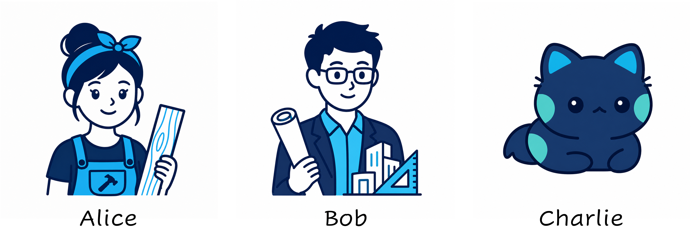

SHAP and Shapley Values
=======================

What does SHAP explain?
-------------------------

SHapley Additive exPlanations (**SHAP**) explains an **individual model
prediction** by assigning a contribution to each input feature. The main idea
is to quantify how much each feature contributes to the difference between a
**baseline prediction** and the prediction for the individual instance.

SHAP is therefore primarily a **local model-agnostic method**. Global
insights can later be obtained by aggregating SHAP values across many
instances.

Importantly, SHAP explains the **model output itself**, not changes in model
performance. This distinguishes SHAP from methods such as permutation feature
importance, which measure how predictive performance changes when feature
information is perturbed.

The quantity explained by SHAP depends on the prediction task:

* **Classification:** the explained model output may be a predicted
  probability, log-odds, or model score for a particular class.
* **Regression:** the explained model output is the predicted numerical value.

In both cases, the SHAP values describe how the input features move the model
output from a **baseline** to the prediction for the individual instance. What
this baseline represents will be introduced below and depends on how
``missing`` feature information is defined.

**What SHAP Does Not Imply**

SHAP explains the behavior of the **model**, not necessarily the underlying
data-generating process.

A large positive or negative SHAP value indicates how a feature contributes
to the model's prediction relative to the chosen baseline. It does not imply
that the feature has a causal effect on the predicted outcome.

The following video provides a short introduction to SHAP and its main
concepts:

.. vimeo:: 745352008?h=3168320cef

    Short video introduction to SHAP.

Shapley Values
-------------------------

SHAP is built on **Shapley values** from cooperative game theory. To
understand how SHAP assigns contributions to individual features, we first
look at how Shapley values assign contributions to players in a cooperative
game.

Cooperative Game Theory
^^^^^^^^^^^^^^^^^^^^^^^^^

Shapley values originate from **cooperative game theory** and provide a
principled way to determine how much each player contributed to a shared
outcome.

The most important concepts are:

* A **player** is a participant in the game.
* A **coalition** :math:`S` is any subset of players working together.
* The **coalition value** :math:`v(S)` describes what that group achieves.
* A player's **marginal contribution** describes how much the coalition value
  increases or decreases when that player joins.
* The **Shapley value** combines these marginal contributions to determine the
  player's overall contribution.

The important idea is that a player's contribution can depend on which other
players are already part of the coalition. Shapley values account for this by
considering the player's contribution across all possible situations.

Players, Coalitions, and Coalition Values
^^^^^^^^^^^^^^^^^^^^^^^^^

To illustrate these concepts, consider a team building a table. The three
players are:

* **Alice (A):** a professional carpenter,
* **Bob (B):** an architect,
* **Charlie (C):** a cat.

   **Players in the cooperative game.** Alice, Bob, and Charlie are the three
   players in the table-building example. Different coalitions of these
   players achieve different values, which are used to determine each
   player's Shapley value.

Different combinations of these players produce different amounts of value.
The question is:

**How should the total value be fairly attributed to Alice, Bob, and
Charlie?**

A coalition is any subset of the available players. With three players,
there are :math:`2^3 = 8` possible coalitions. We assign each coalition a
value :math:`v(S)` describing what that group achieves:

.. list-table:: Coalition values for the table-building example
   :header-rows: 1
   :widths: 20 55 25

   * - Coalition :math:`S`
     - Description
     - :math:`v(S)` (€)
   * - :math:`\emptyset`
     - Nobody works
     - 0
   * - :math:`\{A\}`
     - Alice alone
     - 100
   * - :math:`\{B\}`
     - Bob alone
     - 40
   * - :math:`\{C\}`
     - Charlie alone
     - 0
   * - :math:`\{A,B\}`
     - Alice builds, Bob improves the design
     - 150
   * - :math:`\{A,C\}`
     - Charlie distracts Alice
     - 90
   * - :math:`\{B,C\}`
     - Bob and Charlie
     - 30
   * - :math:`\{A,B,C\}`
     - Charlie gets in the way
     - 140

For example,

.. math::

   v(\{A,B\}) = 150

means that Alice and Bob working together produce a value of €150.

The value of the full coalition is

.. math::

   v(\{A,B,C\}) = 140.

Our goal is to determine how much of this value should be attributed to each
individual player.

Marginal Contributions
^^^^^^^^^^^^^^^^^^^^^^^^^

To measure a player's contribution to a coalition, we compare the coalition
value **before and after the player joins**.

For player :math:`i` joining coalition :math:`S`, the marginal contribution is

.. math::

   \Delta_i(S) = v(S \cup \{i\}) - v(S).

Here,

* :math:`i` is the player of interest,
* :math:`S` is the coalition before the player joins,
* :math:`v(S)` is the value of that coalition.

For example, suppose Bob is already working and Alice joins. Before Alice
joins, coalition :math:`\{B\}` has value 40. After Alice joins, coalition
:math:`\{A,B\}` has value 150. Alice's marginal contribution is therefore

.. math::

   \Delta_A(\{B\})
   = v(\{A,B\}) - v(\{B\})
   = 150 - 40
   = +110.

Alice's marginal contribution depends on the coalition she joins:

.. list-table:: Alice's marginal contributions
   :header-rows: 1
   :widths: 25 25 25 25

   * - Coalition :math:`S`
     - Alice joins
     - Calculation
     - Contribution
   * - :math:`\emptyset`
     - :math:`\{A\}`
     - :math:`100-0`
     - :math:`+100`
   * - :math:`\{B\}`
     - :math:`\{A,B\}`
     - :math:`150-40`
     - :math:`+110`
   * - :math:`\{C\}`
     - :math:`\{A,C\}`
     - :math:`90-0`
     - :math:`+90`
   * - :math:`\{B,C\}`
     - :math:`\{A,B,C\}`
     - :math:`140-30`
     - :math:`+110`

Marginal contributions can also be **negative**. For example, suppose Alice
is already working and Charlie joins:

.. math::

   \Delta_C(\{A\})
   = v(\{A,C\}) - v(\{A\})
   = 90 - 100
   = -10.

In this case, Charlie reduces the coalition value by €10.

Charlie's marginal contributions are:

.. list-table:: Charlie's marginal contributions
   :header-rows: 1
   :widths: 25 25 25 25

   * - Coalition :math:`S`
     - Charlie joins
     - Calculation
     - Contribution
   * - :math:`\emptyset`
     - :math:`\{C\}`
     - :math:`0-0`
     - :math:`0`
   * - :math:`\{A\}`
     - :math:`\{A,C\}`
     - :math:`90-100`
     - :math:`-10`
   * - :math:`\{B\}`
     - :math:`\{B,C\}`
     - :math:`30-40`
     - :math:`-10`
   * - :math:`\{A,B\}`
     - :math:`\{A,B,C\}`
     - :math:`140-150`
     - :math:`-10`

This leads to an important question:

**Which of these marginal contributions represents the player's overall
contribution?**

Average Contribution Across Player Orderings
^^^^^^^^^^^^^^^^^^^^^^^^^

A player's contribution depends on which players are already in the
coalition. The Shapley value accounts for this by averaging the player's
marginal contribution over **all possible orders in which the players can
join**.

With three players, there are

.. math::

   3! = 6

possible orders:

.. code-block:: text

   A -> B -> C
   A -> C -> B
   B -> A -> C
   B -> C -> A
   C -> A -> B
   C -> B -> A

For each order, we ask:

**What is the marginal contribution of Alice when she joins?**

For example, consider

.. code-block:: text

   B -> A -> C

Bob is already present when Alice joins. The coalition before Alice joins is
therefore :math:`\{B\}`, and Alice contributes

.. math::

   v(\{A,B\}) - v(\{B\}) = 150 - 40 = 110.

Doing this for every possible order gives:

.. list-table:: Alice's marginal contribution across all possible orders
   :header-rows: 1
   :widths: 30 35 35

   * - Order
     - Coalition before Alice
     - Alice's contribution
   * - A -> B -> C
     - :math:`\emptyset`
     - :math:`+100`
   * - A -> C -> B
     - :math:`\emptyset`
     - :math:`+100`
   * - B -> A -> C
     - :math:`\{B\}`
     - :math:`+110`
   * - B -> C -> A
     - :math:`\{B,C\}`
     - :math:`+110`
   * - C -> A -> B
     - :math:`\{C\}`
     - :math:`+90`
   * - C -> B -> A
     - :math:`\{B,C\}`
     - :math:`+110`

The **Shapley value** is the average marginal contribution across all possible
player orders. For Alice,

.. math::

   \phi_A
   =
   \frac{100 + 100 + 110 + 110 + 90 + 110}{6}
   =
   103.33.

We can compute the Shapley values for Bob and Charlie in the same way:

.. math::

   \phi_B = 43.33,

.. math::

   \phi_C = -6.67.

In this example, the value of the empty coalition is zero. The three Shapley
values therefore sum to the value of the full coalition:

.. math::

   \phi_A + \phi_B + \phi_C
   =
   103.33 + 43.33 - 6.67
   =
   140,

which is exactly

.. math::

   v(\{A,B,C\}) = 140.

Notice that a **Shapley value can be negative**. Charlie has a negative
Shapley value because, on average, his presence reduces the value produced by
the team.

From Player Orderings to Coalitions
^^^^^^^^^^^^^^^^^^^^^^^^^

Instead of averaging marginal contributions over all possible player
orderings, the Shapley value can equivalently be computed as a **weighted
average over all possible coalitions**.

The coalitions represent the different subsets of players that could already
be present before the player of interest joins.

For example, several different player orderings can lead to the same
coalition being present before Alice joins. Rather than treating these
equivalent situations separately, the coalition formulation groups them
together and assigns the coalition an appropriate weight.

The general Shapley formula is

.. math::

   \phi_i =
   \sum_{S \subseteq N \setminus \{i\}}
   \frac{|S|!(|N|-|S|-1)!}{|N|!}
   \left[
      v(S \cup \{i\}) - v(S)
   \right].

Here,

* :math:`N` is the set of all players,
* :math:`i` is the player of interest,
* :math:`S` is a coalition that does not contain player :math:`i`,
* :math:`|S|` is the number of players in coalition :math:`S`,
* :math:`v(S)` is the value achieved by coalition :math:`S`.

The expression

.. math::

   v(S \cup \{i\}) - v(S)

is the **marginal contribution**: the change in coalition value when player
:math:`i` joins coalition :math:`S`.

The expression

.. math::

   \frac{|S|!(|N|-|S|-1)!}{|N|!}

is the **coalition weight**. It accounts for how often coalition :math:`S`
is already present before player :math:`i` joins across all possible player
orderings.

The Shapley value can therefore be understood in two equivalent ways:

* as the **average marginal contribution across all possible player
  orderings**, or
* as the **weighted average of marginal contributions across all possible
  coalitions**.

Using coalitions avoids treating equivalent player orderings separately by
grouping situations where the same players are present before player
:math:`i` joins.

Shapley Axioms
^^^^^^^^^^^^^^^^^^^^^^^^^

Why are Shapley values considered a principled way to assign contributions?
They are characterized by a set of properties, or **axioms**, describing how
an attribution should behave.

**Efficiency**

The contributions assigned to all players explain the difference between the
value of the full coalition and the value of the empty coalition:

.. math::

   \sum_{i \in N} \phi_i = v(N) - v(\emptyset).

In our example,

.. math::

   v(\emptyset)=0,

so

.. math::

   103.33 + 43.33 - 6.67 = 140.

Thus, the complete outcome relative to the empty coalition is distributed
among the players without leaving any value unexplained.

**Symmetry**

If two players always contribute the same amount to every coalition, they
receive the same Shapley value.

In other words, players that play identical roles in the game are treated
equally.

**Dummy**

If a player never changes the value of any coalition, that player's Shapley
value is zero.

Formally, if

.. math::

   v(S \cup \{i\}) = v(S)

for every coalition :math:`S`, then

.. math::

   \phi_i = 0.

**Additivity**

If two cooperative games are combined, the Shapley value of each player in
the combined game is the sum of that player's Shapley values in the
individual games.

For two games with coalition-value functions :math:`v` and :math:`w`,

.. math::

   \phi_i(v+w) = \phi_i(v) + \phi_i(w).

Together, these properties make Shapley values a **principled way to assign
the outcome of a cooperative game to the individual players**.

In the next section, we transfer this game-theoretic setting to machine
learning: players become input features, coalition values become model
outputs, and Shapley values become feature contributions.

From Shapley Values to SHAP
-----------------------------

We now transfer the idea of Shapley values from cooperative game theory to
machine learning. Instead of asking how much each player contributed to a
shared outcome, we ask how much each input feature contributed to an
individual model prediction.

SHAP applies the same Shapley value formula introduced above. The formula
remains unchanged; only the interpretation of its components changes.

Mapping Game Theory to Machine Learning
^^^^^^^^^^^^^^^^^^^^^^^^^^^^^^^^^^^^^^^^^^^^^^^^^^

The concepts introduced for cooperative games have direct counterparts in
SHAP:

.. list-table:: From Shapley values to SHAP
   :header-rows: 1
   :widths: 25 35 40

   * - Symbol
     - Shapley value
     - SHAP
   * - :math:`i`
     - Player of interest
     - Feature of interest
   * - :math:`N`
     - Set of all players
     - Set of all input features
   * - :math:`S`
     - Coalition of players
     - Subset of input features
   * - :math:`v_x(S)`
     - Value achieved by coalition :math:`S`
     - Model output when the information in feature coalition :math:`S`
       is available for instance :math:`x`
   * - :math:`\phi_i`
     - Player's Shapley value
     - Feature's SHAP value

For an individual instance :math:`x`, the SHAP value of feature :math:`i`
can therefore be written as

.. math::

   \phi_i(x) =
   \sum_{S \subseteq N \setminus \{i\}}
   \frac{|S|!(|N|-|S|-1)!}{|N|!}
   \left[
      v_x(S \cup \{i\}) - v_x(S)
   \right].

The term

.. math::

   v_x(S \cup \{i\}) - v_x(S)

is the feature's **marginal contribution**. It describes how much the model
output changes when the information from feature :math:`i` is added to
coalition :math:`S`.

SHAP therefore uses exactly the same principle as the cooperative-game
example: a feature's contribution is evaluated in different feature
coalitions and these marginal contributions are combined into its SHAP value.

There is, however, an important practical question. A machine-learning model
usually expects a complete input, even when only the information from a
subset of features is considered available. Features outside the coalition
must therefore somehow be represented as **"missing"**.

How this missing information is represented depends on the data modality and
the SHAP explainer. This choice determines how coalition values
:math:`v_x(S)` are evaluated and will be discussed separately for tabular,
image, and text data.

Additive Decomposition
^^^^^^^^^^^^^^^^^^^^^^^^^

The Shapley efficiency property states that the Shapley values explain the
difference between the value of the full coalition and the value of the empty
coalition:

.. math::

   \sum_{i \in N} \phi_i
   =
   v(N) - v(\emptyset).

In SHAP, the **full coalition** corresponds to the complete instance being
explained. Its coalition value is therefore the model prediction

.. math::

   v_x(N) = f(x).

The **empty coalition** represents the situation in which none of the
feature information from the instance is available. Its value

.. math::

   v_x(\emptyset)

defines the **baseline** against which the prediction is explained.

The efficiency property therefore becomes

.. math::

   \sum_{i \in N} \phi_i
   =
   f(x) - v_x(\emptyset).

Rearranging gives the additive decomposition of an individual prediction:

.. math::

   f(x)
   =
   v_x(\emptyset)
   +
   \sum_{i \in N} \phi_i.

Here,

* :math:`f(x)` is the model prediction for the individual instance,
* :math:`v_x(\emptyset)` is the **baseline**, and
* :math:`\phi_i` is the contribution of feature :math:`i`.

The SHAP values therefore collectively explain the complete difference
between the baseline and the individual prediction.

A positive SHAP value indicates that a feature contributes toward increasing
the model output relative to the baseline, while a negative SHAP value
contributes toward decreasing it. The magnitude of the SHAP value indicates
the strength of the contribution.

For example, a prediction could be decomposed as

.. code-block:: text

   Baseline                    0.40
   Age                        +0.15
   BMI                        +0.08
   Income                     -0.04
   Smoking                    +0.11
                              -----
   Prediction                  0.70

The individual feature contributions sum to

.. math::

   0.15 + 0.08 - 0.04 + 0.11 = 0.30,

which is exactly the difference between the prediction and the baseline:

.. math::

   0.70 - 0.40 = 0.30.

Contrastive Explanations
^^^^^^^^^^^^^^^^^^^^^^^^^

SHAP is therefore a **contrastive explanation method**. It does not explain
the prediction :math:`f(x)` in isolation. Instead, it explains how the input
features move the model output from the baseline to the prediction:

.. math::

   \underbrace{f(x)}_{\text{prediction}}
   =
   \underbrace{v_x(\emptyset)}_{\text{baseline}}
   +
   \underbrace{\sum_{i \in N}\phi_i}_{\text{feature contributions}}.

The baseline is the value of the **empty feature coalition**. Importantly,
there is no single universal way to construct this empty coalition for every
SHAP explanation.

What :math:`v_x(\emptyset)` represents depends on how "missing" feature
information is defined for the particular data modality and explainer.
Consequently, SHAP values must always be interpreted relative to the
corresponding baseline.

For example, later sections will show that an empty coalition can be
represented differently for tabular, image, and text data. These different
definitions of missingness determine both the coalition values and the
baseline used by the explanation.

Computational Challenge
^^^^^^^^^^^^^^^^^^^^^^^^^

The definition of Shapley values requires considering all possible feature
coalitions. For :math:`M` input features, there are

.. math::

   2^M

possible coalitions.

The number of coalitions therefore grows **exponentially** with the number of
features:

.. list-table::
   :header-rows: 1
   :widths: 40 60

   * - Number of features
     - Number of possible coalitions
   * - 10
     - 1,024
   * - 20
     - 1,048,576
   * - 30
     - 1,073,741,824

For only 20 features, more than one million feature coalitions are already
possible. Exhaustively evaluating all coalitions therefore quickly becomes
infeasible for real-world machine-learning problems.

In practice, different SHAP algorithms reduce this computational cost through
**approximation** or by exploiting properties of the **model and data**.

SHAP should therefore not be understood as a single algorithm. It is a
framework for Shapley-based feature attribution that can be implemented using
different computational strategies. The practical notebooks introduce
examples of these different explainers.

Advantages and Limitations
^^^^^^^^^^^^^^^^^^^^^^^^^

Advantages
~~~~~~~~~~~~~~~~~~~~~~~~~~~~~~~~~~~~

**Principled feature attribution**

SHAP is based on **Shapley values** from cooperative game theory. The resulting
feature contributions satisfy well-defined properties such as efficiency,
symmetry, dummy, and additivity. This provides a principled basis for
attributing a model prediction to its input features.

**Local explanations**

SHAP decomposes an individual prediction into feature-specific contributions
relative to a defined baseline. Each SHAP value describes how a feature
contributes to the difference between the baseline and the individual
prediction.

**Local and global interpretation**

Although SHAP values explain individual predictions, they can be aggregated
across many instances to obtain global insights into model behavior. The same
underlying feature contributions therefore form the basis of both local and
global interpretations.

Limitations
~~~~~~~~~~~~~~~~~~~~~~~~~~~~~~~~~~~~

**Missingness and feature dependence**

SHAP requires defining how features outside a coalition are represented as
"missing". This choice determines how coalition values are evaluated and can
therefore affect the resulting feature attributions.

The problem is particularly important for dependent features. Treating one
feature as missing while retaining a related feature can break dependencies,
produce unrealistic inputs, or distribute shared information across multiple
features.

**Computational complexity**

Exact Shapley computation grows exponentially with the number of features,
since up to :math:`2^M` feature coalitions must be considered. Practical SHAP
algorithms therefore rely on approximation or exploit properties of the model
and data to reduce this computational cost.

**Reference dependence**

SHAP values are contrastive: they explain a prediction relative to the
baseline :math:`v_x(\emptyset)`. How the empty coalition is represented
therefore matters. Changing the definition of missingness or the reference
used to construct the empty coalition can change both the baseline and the
resulting SHAP values.

