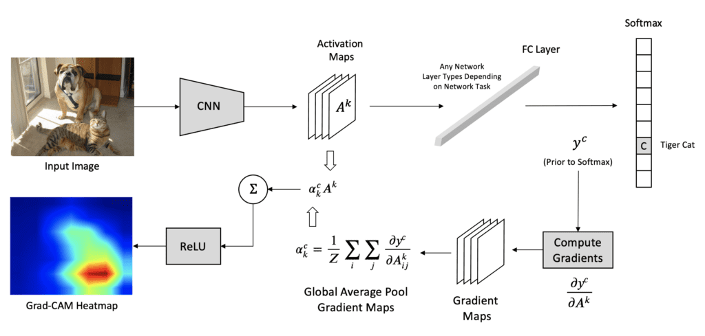

Introduction to Grad-CAM
=========================================

Grad-CAM (Gradient-weighted Class Activation Mapping) is a **model-specific** method, which provides local explanations for Deep Neural Networks.

For a short introduction to Grad-CAM, click below:

.. vimeo:: 745319946?h=fcd327fc80

    Short video lecture on the principles of Grad-CAM.

In summary, Grad-CAM is an explainability technique that visually highlights the regions in an image that are most important for a deep neural network's classification decision.
Grad-CAM works by computing the gradients of the model's output with respect to the feature maps in the final convolutional layer,
effectively revealing which parts of the image the model 'looks at' when making a prediction.

Grad-CAM for CNNs
--------------------

We now show you how to compute Grad-CAM localization maps for a trained CNN model. 
The figure below summarizes all steps:

**Step 1: Forward Pass**

Pass the input (image/signal) through the CNN to get the feature maps from the last convolutional layer
and raw outputs (logits) before softmax. We denote these feature maps as :math:`A^k`, 
where :math:`k` refers to one specific feature map inside a convolutional layer.

*Note: A single convolutional layer produces multiple feature maps (one per filter)*

Grad-CAM uses the feature maps from the last conv layer because it typically has the 
most high-level, semantically rich features but still retains some spatial information.
Using earlier layers would provide too much low-level information (edges, textures) and 
not enough conceptual understanding.

**Step 2: Select the Target Class**

Choose the class :math:`c` you want to explain (usually the predicted class with highest score) and calculate its score.
Let us assume :math:`y^c` is the score for class :math:`c` i.e., the output for class :math:`c` before the softmax.

**Step 3: Compute the Gradients**

Compute the gradient of the target class score :math:`y^c` with respect to the feature maps :math:`A^k` of 
the selected convolutional layer, i.e., :math:`\frac{\partial y^c}{\partial A^k}`. 
These gradients show how important each feature map is for the target class.

**Step 4: Compute the Grad-CAM**

For each filter :math:`k`, global average pool the gradients spatially (over width :math:`i` and height :math:`j`) 
to get a single scalar weight :math:`\alpha_k^c`:

.. math::

   \alpha_k^c = \frac{1}{Z} \sum_{i} \sum_{j} \frac{\partial y^c}{\partial A_{ij}^k}

where :math:`y^c` is the score for class :math:`c` and :math:`A^k` is the feature map for filter :math:`k`.

To calculate the final Grad-CAM localization map multiply each feature map :math:`A^k` by its corresponding 
importance weight :math:`\alpha_k^c` and then sum up all the weighted feature maps across all filters. 
Apply a ReLU activation to keep only the parts that positively influence the target class.
This makes the Grad-CAM map focus only on features that support the class, not those that suppress it.

.. math::
    L^c_{Grad-CAM} = ReLU (\sum_{k} \alpha_k^c A^k)

**Step 5: Post-processing**

Resize the Grad-CAM map to the same spatial size as the input so it can be overlaid on the input.
Overlay the Grad-CAM map on top of the original input, typically using a heatmap.
The Grad-CAM highlights areas in the input that are significant for CNN's prediction of class :math:`c`, 
providing insights into what the network 'sees' as important for its decision-making.

References
----------

- **Grad-CAM:** Selvaraju, R. R., Cogswell, M., Das, A., Vedantam, R., Parikh, D., & Batra, D. `Grad-cam: Visual explanations from deep networks via gradient-based localization. <https://doi.org/10.1109/ICCV.2017.74>`_ ICCV. 2017
- **Tutorial on Grad-CAM:** `Grad-CAM for ResNet152 network <https://medium.com/@stepanulyanin/grad-cam-for-resnet152-network-784a1d65f3>`_
- **XAI Book:** Molnar, C. `Interpretable Machine Learning: A Guide for Making Black Box Models Explainable. <https://christophm.github.io/interpretable-ml-book/>`_ Lulu.com. 2022.

