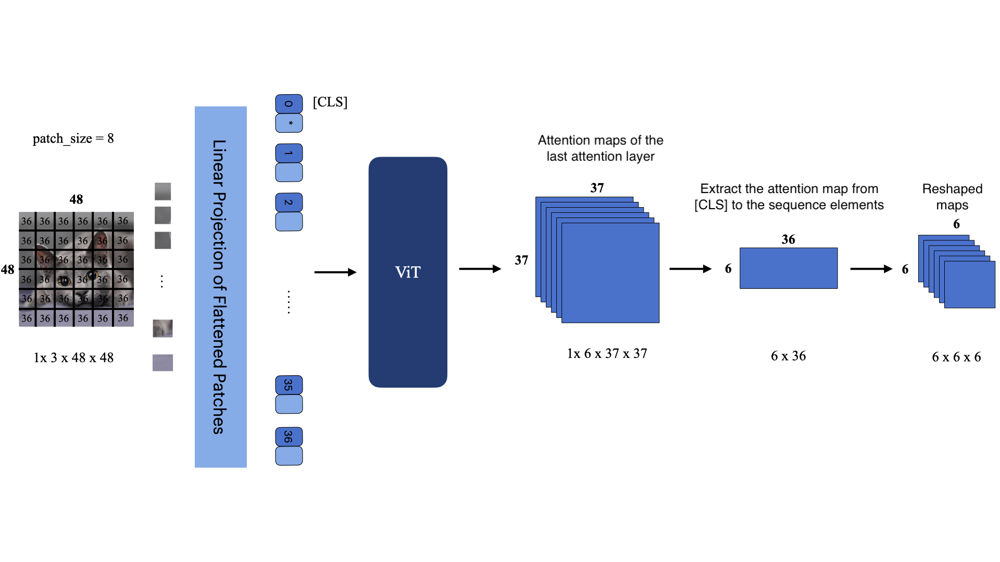

Introduction to Attention Maps
=========================================

An **attention map** is a visualization or representation that highlights how much importance or "attention" a model gives to different parts of its input data when making predictions. 
These maps are visual aids that highlight the importance or relevance of different parts of the input data, such as text tokens or image patches.

An attention map is a matrix or grid where each element represents the attention score, which are calculated as the dot product of queries and keys within the model. 
These scores define the scope of the attention mechanism and typically range between 0 and 1, indicating how much influence or relevance one part of the input has when processing another part or when making a prediction.
The idea is to allow the model to selectively focus on different parts of the input, rather than treating all parts equally, thereby improving the model's performance on tasks where some parts of the input are more important than others.

Attention maps can be visualized as heatmaps where different regions are colored to represent the varying levels of attention (or importance) assigned by the model. 
Areas with higher attention scores are typically shown in brighter or warmer colors, while areas with lower attention scores are shown in darker or cooler colors.
In this way, attention maps provide an interpretable layer that reveals which parts of the input data are being given more weight by the model during prediction.

Attention maps are used for explainability in Natural Language Processing as well as Computer Vision. 
For text-related tasks, attention maps show how much focus is placed on each word or token in a sentence relative to others. This helps in understanding relationships between words and interpreting the model's decisions.
In image-related tasks, attention maps can highlight which parts of an image the model is focusing on. For example, in image classification, an attention map might show which regions of an image are most relevant for classifying an object.

Attention maps for text and images serve similar purposes but differ in how they are generated and interpreted due to the inherent differences between these two types of data.

Attention Maps for text
-------------------------

Text is represented as sequential and discrete data and converted into embedded tokens (word, subword, or character). The attention mechanisms focuses on the relationships between these tokens.
Attention maps for Sequence Transformers are usually generated through a self-attention or cross-attention mechanism. The map is a matrix, typically of size :math:`\text{sequence length} \times \text{sequence length}`, 
where each element represents the attention weight between two tokens in the one sequence ot in relation to another sequence. 

Attention Maps from Self-Attention
^^^^^^^^^^^^^^^^^^^^^^^^^^^^^^^^^^^

The attention weight are calculated within a single sequence to model the interactions between different elements of that sequence. The process involves queries, keys, and values, all of which are derived from the same input data. 
Here's a step-by-step explanation of how these attention weight are calculated:

1. **Linear Transformations**: Each element (like a word in a sentence) of the input sequence is transformed into three vectors: a query vector ($ Q$), a key vector ($ K$), and a value vector ($ V$). These transformations are usually done using different learned linear layers (or affine transformations).

2. **Score Calculation**: For each element of the sequence, scores are calculated by taking the dot product of its query vector with the key vector of every other element in the sequence. The score :math:`\text{score}(i, j)` represents the influence of the $ j$-th element on the $ i$-th element. The formula is: :math:`\text{score}(Q_i, K_j) = Q_i \cdot K_j^T`

3. **Scaling**: The scores are often scaled down by the square root of the dimension of the key vectors ($ \sqrt{d_k}$). This is done to stabilize the gradients during training. So, the scaled score is: :math:`\text{scaled score}(Q_i, K_j) = \frac{Q_i \cdot K_j^T}{\sqrt{d_k}}`

4. **Softmax Normalization**: Apply the softmax function to the scaled scores for each query. This step converts the scores to a probability distribution (the attention weights), ensuring that they are all positive and sum up to 1: :math:`\alpha_{ij} = \text{softmax}(\text{scaled score}(Q_i, K_j)) = \frac{\exp(\text{scaled score}(Q_i, K_j))}{\sum_{k=1}^{n} \exp(\text{scaled score}(Q_i, K_k))}`

Here, :math:`\alpha_{ij}` represents the attention attention weight from the :math:`i`-th query to the :math:`j`-th key.

Attention Maps from Cross-Attention
^^^^^^^^^^^^^^^^^^^^^^^^^^^^^^^^^^^

An alternative approach is to generate attention maps through the cross-attention mechanism. 
In cross-attention the attention is computed between two different sequences, allowing the model to focus on how elements in one sequence relate to elements in another, e.g. aligning words in one language with words in another language.

Here's how cross-attention weights are typically generated:

1. **Preparation of Queries, Keys, and Values**: In cross-attention, the queries (:math:`Q`) are derived from one sequence, such as the current state of the decoder in a machine translation model. The keys (:math:`K`) and values (:math:`V`) are derived from another sequence, like the encoder's output. These vectors are obtained through learned linear transformations from their respective input data.

2. **Score Calculation**: The model calculates scores between each query and all keys. These scores represent the relevance of each element in the key sequence to the respective query. The calculation commonly uses the dot product: :math:`\text{Score}(Q, K) = QK^T`. This dot product measures the compatibility between queries and keys.

3. **Scaling**: The scores are scaled by the square root of the dimension of the keys (:math:`\sqrt{d_k}`). This scaling is performed to stabilize the gradients during training. The scaled score becomes: :math:`\text{Scaled Score} = \frac{QK^T}{\sqrt{d_k}}`.

4. **Softmax Normalization**: The softmax function is applied to these scaled scores across the keys for each query. This normalization process transforms the scores into a set of attention weights: :math:`A = \text{softmax}\left(\frac{QK^T}{\sqrt{d_k}}\right)`. These attention weights determine the extent to which each element in the key sequence is considered when constructing the output for each query.

The attention weights matrix :math:`A` obtained from these steps is used to create cross-attention maps. 
Each matrix element, :math:`A_{ij}`, represents the attention weight from the :math:`i`-th element of the query sequence to the :math:`j`-th element of the key sequence. 
These maps visually demonstrate how the model attends to different parts of one sequence (represented by keys) in relation to each part of another sequence (represented by queries), thus providing insight into the model's learning and decision-making process.

Attention Maps for images
--------------------------
Images are represented as spatial and continuous data, typically as a grid of pixels with multiple channels (e.g., RGB for color images).
Attention mechanisms in images focus on regions within the grid that contribute to the task, such as object detection or classification.

Attention maps in images can be generated in several ways, e.g through self-attention in Vision Transformers (ViTs).
In ViTs, the attention map is applied to patches of the image rather than individual pixels, representing how much one image patch attends to another.

References
------------
- **Original ViT paper:** Kolesnikov, A., Dosovitskiy, A., Weissenborn, D., `An Image is Worth 16x16 Words: Transformers for Image Recognition at Scale. <https://openreview.net/forum?id=YicbFdNTTy>`_ ICLR. 2021
- **DINO paper:** Caron, M., Touvron, H., Misra, I., Jégou, H., Mairal, J., Bojanowski, P., & Joulin, A. `Emerging properties in self-supervised vision transformers. <https://openaccess.thecvf.com/content/ICCV2021/html/Caron_Emerging_Properties_in_Self-Supervised_Vision_Transformers_ICCV_2021_paper>`_ ICCV. 2021
