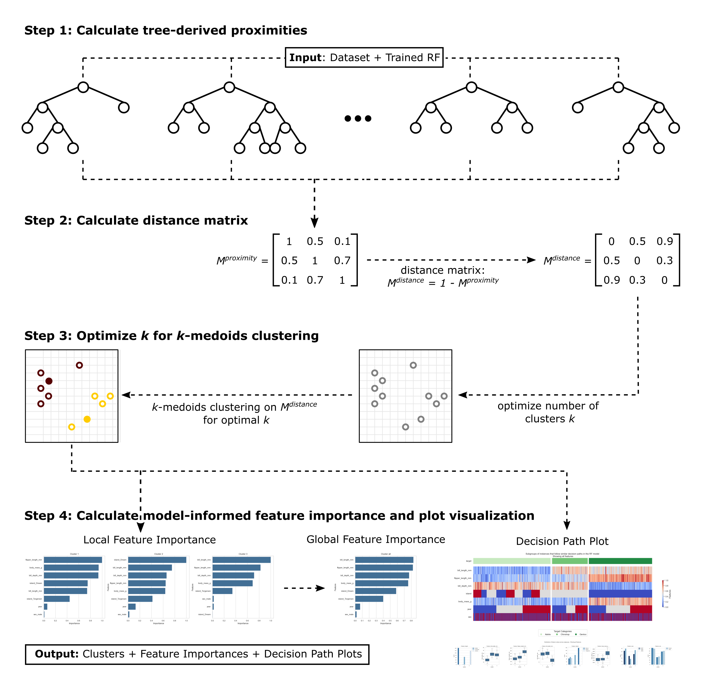

Introduction to Forest-Guided Clustering
=========================================

What does Forest-Guided Clustering explain?
--------------------------------------------

**Forest-Guided Clustering (FGC)** is a model-specific explanation method for Random Forest models. It reveals how a trained forest organizes a collection of samples by grouping samples that follow similar decision paths through the trees. FGC therefore does not cluster samples directly according to their distances in the original feature space. Instead, it constructs a new, model-informed representation of similarity from the internal structure of the forest. Two samples are considered similar when the forest processes them similarly, even when their original feature values are not geometrically close.

FGC is a **global and subgroup-level method**. It describes structure across a dataset and characterizes the resulting groups, but it does not explain an individual prediction. In FGC, the term *local feature importance* refers to importance within a cluster, not to an explanation for one individual sample. FGC is also **task-guided**. The Random Forest from which the similarities are derived was trained to predict a target, and target alignment is considered when the number of clusters is selected. The resulting clusters therefore represent subgroups that are relevant to the fitted model and its prediction task, rather than purely unsupervised structure in the input data.

The following video provides a short introduction to FGC and its main concepts:

.. vimeo:: 746443233?h=07ddf2290b

    Short video lecture on the principles of Forest-Guided Clustering.

Overview of the FGC algorithm
-----------------------------

FGC transforms the internal decision structure of a trained Random Forest into interpretable groups of samples. The algorithm consists of four main steps:

1. compute pairwise proximities from the trees,
2. transform the proximities into pairwise dissimilarities,
3. cluster the samples using :math:`k`-medoids, and
4. characterize and visualize the resulting clusters.

The input to FGC is a trained Random Forest together with the samples to be explained. Its output consists of model-guided clusters, cluster-specific and global feature-characterization scores, and visualizations that summarize the patterns distinguishing the clusters.

   **Forest-Guided Clustering workflow.** FGC first derives pairwise sample
   proximities from a trained Random Forest and transforms them into a
   model-informed distance matrix. It then applies :math:`k`-medoids
   clustering, selecting :math:`k` based on target alignment and clustering
   stability. Finally, FGC characterizes the resulting model-defined
   subgroups using cluster-specific and global feature importance scores and
   visualizes their feature and target patterns in a decision-path plot.

Step 1: Compute forest-derived proximities
------------------------------------------

Let :math:`x_i` and :math:`x_j` denote two samples and let :math:`T` be the number of trees in the forest. FGC passes both samples through every tree and computes how similarly the trees process them. The similarities from all trees are then averaged to obtain a pairwise proximity :math:`P(x_i, x_j)` between 0 and 1.

* A proximity close to 1 means that the two samples follow very similar decision structures across the forest.
* A proximity close to 0 means that their decision paths tend to separate.

Two definitions of forest-derived proximity are available: **terminal-leaf proximity** and **least common ancestor proximity**.

Terminal-leaf proximity
^^^^^^^^^^^^^^^^^^^^^^^

Terminal-leaf proximity measures how often two samples reach exactly the same terminal leaf. Let :math:`L_t(x)` denote the terminal leaf reached by sample :math:`x` in tree :math:`t`. The proximity is

.. math::

   P_{\mathrm{TL}}(x_i,x_j)
   =
   \frac{1}{T}
   \sum_{t=1}^{T}
   \mathbb{I}\!\left(L_t(x_i)=L_t(x_j)\right),

where :math:`\mathbb{I}(\cdot)` is 1 when the condition is true and 0 otherwise.

Each tree therefore makes a binary contribution:

* 1 if the samples reach the same terminal leaf,
* 0 if they reach different terminal leaves.

For example, if two samples share a terminal leaf in five out of six trees, their terminal-leaf proximity is

.. math::

   P_{\mathrm{TL}}(x_i,x_j)=\frac{5}{6}\approx 0.83.

Terminal-leaf proximity is intuitive: samples that repeatedly end in the same leaves are treated as similar by the forest. However, it ignores how much of the path two samples shared before they reached different leaves. Samples that separate only at the final split receive the same contribution of 0 as samples that separate near the root.

Why terminal-leaf proximity can be sparse in regression forests
^^^^^^^^^^^^^^^^^^^^^^^^^^^^^^^^^^^^^^^^^^^^^^^^^^^^^^^^^^^^^^^^^

In classification trees, nodes can become class-pure relatively early because the target consists of a finite set of class labels. Some branches therefore stop before reaching the maximum depth, often producing larger terminal leaves that contain several samples.

With a continuous regression target, perfectly homogeneous nodes are rare. More branches may continue growing, and tuned regression forests are often deeper and more fine-grained. Their terminal leaves consequently tend to be smaller. In practice, this difference can have an important effect on terminal-leaf proximity:

* classification forests often produce more shared terminal-leaf assignments and a less sparse proximity matrix;
* regression forests often produce fewer shared terminal-leaf assignments and a proximity matrix with many zero entries.

Exact terminal-leaf co-occurrence may therefore contain too little graded information for regression forests. The least common ancestor proximity was introduced to retain information about partially shared decision paths.

Least common ancestor proximity
^^^^^^^^^^^^^^^^^^^^^^^^^^^^^^^

The **least common ancestor (LCA)** of two samples in a tree is the deepest node that belongs to both decision paths. Its depth indicates how long the two samples followed the same path before separating. Let :math:`\operatorname{LCA}_t(x_i,x_j)` be the least common ancestor of :math:`x_i` and :math:`x_j` in tree :math:`t`. The normalized LCA proximity is

.. math::

   P_{\mathrm{LCA}}(x_i,x_j)
   =
   \frac{1}{T}
   \sum_{t=1}^{T}
   \frac{
      \operatorname{depth}_t\!\left(
         \operatorname{LCA}_t(x_i,x_j)
      \right)
   }{
      \max\!\left(
         \operatorname{depth}_t(x_i),
         \operatorname{depth}_t(x_j)
      \right)
   }.

The depth of the shared path is normalized by the larger of the two terminal depths, making trees with different depths comparable before the values are averaged across the forest.

Unlike terminal-leaf proximity, LCA proximity is graded:

* samples that separate close to the root receive a low proximity;
* samples that separate late in the tree receive a high proximity;
* samples that reach the same terminal leaf receive the maximum contribution for that tree.

LCA proximity can therefore distinguish samples in neighboring terminal regions from samples whose decision paths differ almost completely.

Step 2: Derive the pairwise dissimilarity matrix
------------------------------------------------

Clustering requires pairwise dissimilarities rather than similarities. FGC therefore transforms the chosen proximity matrix :math:`P` into a model-informed dissimilarity matrix :math:`D`:

.. math::

   D_{ij}=1-P_{ij}.

Consequently, samples with high forest-derived proximity have low dissimilarity, while samples that follow different decision structures have high dissimilarity. This matrix describes separation in the model's learned decision space, not geometric separation in the original feature space.

Step 3: Cluster the samples
---------------------------

FGC applies :math:`k`-medoids clustering directly to the forest-derived dissimilarity matrix. In contrast to clustering methods that require samples to be represented by Euclidean coordinates, :math:`k`-medoids can operate on pairwise dissimilarities. Each cluster is represented by a **medoid**, which is an observed sample with a central position in that cluster. The number of clusters :math:`k` controls the resolution of the explanation. Too few clusters may hide relevant subgroups, whereas too many clusters may produce an unstable and unnecessarily fragmented representation. FGC therefore evaluates candidate values of :math:`k` using two complementary criteria:

* **target alignment:** samples within a cluster should have coherent target values; and
* **stability:** similar clusters should be recovered when the data are resampled.

For classification, target alignment is assessed through class purity while accounting for class imbalance. For regression, it is assessed through the variation of the target within clusters. Stability is evaluated by comparing cluster memberships across bootstrap resamples. Among sufficiently stable solutions, FGC selects the clustering with the strongest target alignment.

Step 4: Characterize and interpret the clusters
------------------------------------------------

After clustering, FGC identifies the features that distinguish each model-defined subgroup. For every cluster and feature, it compares the within-cluster feature distribution with the corresponding distribution in the full dataset. A feature receives a high cluster-specific score when its distribution in that cluster differs strongly from its global distribution. These scores characterize the feature patterns associated with the cluster; they should not be interpreted as causal effects or as individual prediction attributions.

FGC provides two levels of feature characterization:

* **cluster-specific feature importance** highlights the features that distinguish one cluster from the full dataset;
* **global feature importance** aggregates the cluster-specific scores to identify features that differentiate the model-guided clustering structure overall.

Decision-path visualizations combine cluster assignments, feature patterns, target information, and optional metadata. They can help reveal subgroups that support the intended prediction task, but also structure associated with confounders, batch effects, or other unwanted signals. 

Advantages and limitations
--------------------------

Advantages
^^^^^^^^^^

- **Insight into the model's internal structure**: FGC reveals how a Random Forest organizes samples into distinct decision regions across its ensemble of trees.
- **Model-guided subgroup discovery**: FGC groups samples that follow similar decision paths, revealing structure aligned with the fitted model and its prediction task.
- **Cluster-specific feature characterization**: FGC identifies features whose distributions distinguish each model-defined subgroup, complementing purely global or individual feature-attribution methods.
- **Preserves learned interactions**: FGC uses the nonlinear and interaction structure captured by the forest without requiring an explicit feature-independence assumption.

Limitations
^^^^^^^^^^^

- **Model-specific**: FGC requires access to the internal tree structure of a trained Random Forest. It cannot be applied unchanged to arbitrary black-box models.
- **Model-dependent explanations**: The discovered clusters reflect the fitted model. They may reproduce biases, confounders, or artifacts learned from the training data and should be validated using domain knowledge and relevant metadata.
- **Computational cost**: Computing pairwise proximities and clustering the resulting matrix can be expensive for large datasets. Scalable variants reduce this burden by performing parts of the clustering on representative subsamples.

Further reading and practical tutorial
--------------------------------------

* `Forest-Guided Clustering preprint
  <https://arxiv.org/abs/2507.19455>`_
* `Forest-Guided Clustering package documentation
  <https://forest-guided-clustering.readthedocs.io/en/latest/>`_
* `Practical FGC tutorial for Random Forest models
  <https://github.com/HelmholtzAI-Consultants-Munich/XAI-Tutorials/blob/main/xai-for-random-forest/Gen-4-Tutorial_FGC.ipynb>`_
